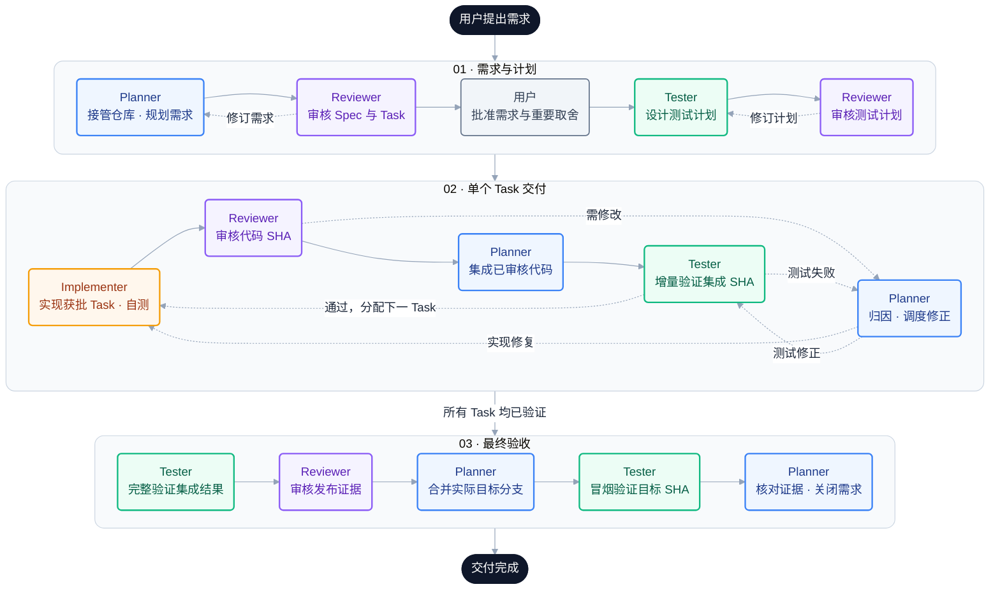

<div align="center">

# RIC DevFlow Skills

**把一次编码请求，升级成可审计、可接管、可交付的软件工程闭环。**

面向 Codex、Claude Code 和 ZCode 的五 Skill 发布包：一个准备入口，加规划、独立审核、独立测试和受控实现四个业务角色。


</div>

---

## 快速开始

已安装 Node.js 后，在终端执行以下命令，将 Skill 安装到用户范围：

```bash
npx skills add lichong-a/ric-dev-workflow-skills -g
```

按安装器提示选择当前使用的 Agent，以及 `ric-devflow` 入口或全部五个 `ric-` Skill。此命令用于首次安装；已有同名 Skill 时先按[安装与恢复](#安装与恢复)检查，避免覆盖定制内容。

安装后，在目标项目中调用入口并描述需求：

```text
使用 ric-devflow，帮我完成当前项目的开发任务。
```

Codex 可显式使用 `$ric-devflow`，Claude Code 可使用 `/ric-devflow`。入口会确认当前宿主，检查并补齐同源缺件，配置所需原生角色，再继续原任务；如宿主需要重新加载，按入口给出的恢复说明继续。安装文件齐备不等于原生角色已经加载。

## 为什么是 DevFlow

普通 Agent 很擅长写代码，但复杂需求的真正难点往往不是“能不能写”，而是：

- 是否先弄清了既有仓库的真实入口、规则和历史包袱；
- 需求、测试、实现和审核是否绑定同一个版本与 Commit SHA；
- 谁可以修改什么，谁不能审核自己的工作；
- 环境、凭据或 live 服务缺失时，能否只阻塞受影响切片；
- 多轮审核是否会一次次释放新问题，导致成本和等待失控；
- 中途换 Agent 后，能否从持久证据恢复，而不是重新阅读整段对话。

RIC DevFlow Skills 把这些约束做成一套纯指令式工作流。它不增加新的 CLI、守护进程或状态机，而是让宿主 Agent 在使用目标仓库原有 Git、测试、CI 和发布工具时，遵循清晰的角色边界、G0–G10 门禁和不可变证据规则。

## 一眼看懂

**Planner 统一调度，Reviewer 独立把关，Tester 用证据验证，Implementer 在批准范围内实现。**

下图按「需求与计划 → 单个 Task 交付 → 最终验收」展开。同色节点代表同一角色，实线表示通过后推进，虚线表示退回或继续下一项 Task。箭头展示产物的推进顺序；所有角色动作都由同一个 Planner 调度，完成后向它回传结果。



> **如何读回路：** 审核不通过或测试失败时，先回到 Planner 归因，再交给负责的角色修正；新代码必须重新审核、重新验证。图中展开了常见的实现/测试返修；Spec、范围或测试计划中的预期/环境变化须复核受影响的批准，环境或授权缺失则记录 `BLOCKED` 和恢复条件。最终验收失败同样走这个回路，不能直接进入「交付完成」。门禁的适用范围与证据复用规则见[门禁策略](skills/ric-devflow/references/contracts/gate-policy.md)。

| 角色 | 默认调用方式 | 核心职责 | 写入边界 |
|---|---|---|---|
| `ric-devflow` | 范围内完整开发隐式调用，也可显式调用 | 识别宿主和范围、按需补装与加载核验、角色路由 | 仅已授权准备，不承担第五业务角色 |
| `ric-devflow-planner` | 仅显式调用或由入口精确路由 | 需求接收、仓库接管、Spec、Task DAG、状态、调度、归因、合并与关闭 | 规划/状态产物和已过门禁的 Git 协调；不写生产代码 |
| `ric-devflow-reviewer` | 仅显式调用或由 Planner 委派 | 独立审核基线、Spec、测试计划、代码和发布证据 | 只读；只返回 `APPROVE`、`REQUEST_CHANGES` 或 `BLOCKED` |
| `ric-devflow-tester` | 仅显式调用或由 Planner 委派 | 测试计划、特征测试、集成/E2E/回归验证、缺陷证据 | 只写测试及自身证据；不改生产代码 |
| `ric-devflow-implementer` | 仅显式调用或由 Planner 委派 | 在一个已批准 Task 和变更预算内完成最小完整实现 | 只处理获批范围；不改 Spec、不自审、不合并 |

## 核心卖点

### 1. 优先支持已有项目的接手与迭代（Brownfield）

**Brownfield 指在已有项目上继续开发**：例如给现有系统加功能、修复线上问题，或接着别人做了一半的功能继续完成。只要已有代码、测试、接口约定、数据迁移或未提交改动，就需要先理解并保护这些现状；这个词并不只指老旧或质量差的项目。与之相对，Greenfield 指从零开始的新项目。

DevFlow 不假设项目从零开始。进入既有仓库时，它会先识别生效规则、真实目标分支、脏工作区、基线失败、相邻实现、契约和变更预算；续接半成品时，还会区分已接受、未验证、部分完成、Stub、冲突和未知工作。

### 2. 证据跟着版本和 SHA 走

Spec、用户批准、Review、Implementation Report 和 Test Report 都有明确身份。代码审核绑定精确的 `base_sha..head_sha`，测试绑定 `tested_sha`，发布审核绑定集成 SHA。分支名移动、行为变化或证据过期时，对应门禁会失效，而不是继续沿用一份“看起来通过”的旧结论。

### 3. 真正的职责隔离

Planner 不写生产代码，Reviewer 不修改被审核对象，Tester 不替 Implementer 修代码，Implementer 不改变需求也不合并。角色分离不是形式：它直接限制文件写入、批准权限和状态所有权。

### 4. 大需求先分期，再进入正式审核

首次 `SPEC_REVIEW` 前做有界预检；只有真实独立发布/验收边界才分期，同时保留完整能力清单。默认一个完整纵向 Task，接口、校验、测试与文档在 Task 内分步实现；文件多、步骤多或耗时长不自动增加任务。

### 固定 DAG，不递归启动研发流程

只有 Root Planner 调度角色；Implementer、Tester、Reviewer 不创建子任务或再次启动四角色流程。DAG 首次规划完成即作为送审基线，G2 通过后冻结；内部顺序、正常返修、上下文恢复和测试细化不改图。只有用户改变范围、已证实的依赖错误或无法在原 Task 内解决的安全/权限/环境/发布障碍，才记录依据并局部复审改图；不全图重建。

G0–G4 为当前 Root/阶段共享，不为每个步骤重走。内部步骤、不适用的额外基线专项、已由有效独立证据覆盖的重复审核可以直接省略；完整代码候选的 G5/G6 和最终验收仍保留。所谓“跳过审核”是少一次不必要的调用，不是替未审核代码写 APPROVE。详细规则见[门禁策略](skills/ric-devflow/references/contracts/gate-policy.md)。

### 5. 更小的上下文，更快的恢复

角色交接只传 Root Issue、动作、精确产物路径/版本、适用 SHA、当前 Finding/Defect、允许与保护路径、输出和停止条件。完整材料从持久产物读取；平台支持时默认使用最小上下文继承，例如 `fork_turns: "none"`。

完整开发通常由 Root Planner 加实现、测试、审核各一个可复用会话按阶段工作；优先复用同角色，不按文件、用例、维度、修复轮次或报告章节新增代理。复杂行为确需独立盲评时，先说明不能复用的具体原因及收益，再增加最少执行者；这不是硬性并发上限，独立测试和审核仍保留。窄幅维护、独立文档和收尾不重新启动整套流程，也不另派报告写作代理。完整规则见[按需派发与会话复用](skills/ric-devflow/references/shared/orchestration.md#按需派发与会话复用)。

交接首行、首条进度和返回结果会注明“职责：实现者｜Skill布局”等中文职责与工作。原生角色 ID 保持稳定；工具支持时，调用任务名采用 `ric_implementer_skill_layout` 等可读名称。Skill UI 展示名与平台子代理昵称不同，修改展示名不会保证旧会话改名；当前没有重命名接口时用职责自述说明，不为换名新开代理。临时 ID 映射仅留 `.local`，正式证据仍使用业务 ID 与真实作者。见[职责命名与可读交接](skills/ric-devflow/references/shared/orchestration.md#职责命名与可读交接)。

### 6. Reviewer 循环可收敛

Reviewer 必须在一轮中完成全部适用维度，并一次性返回当时可发现的全部 P0/P1/P2 Finding。窄修正优先由同一 Reviewer 做 Delta 复审；同一对象连续两次 `REQUEST_CHANGES` 仍未收敛时，Planner 先停下来归因，而不是继续制造新版本。

### 7. 不把 Mock 当成上线证明

测试计划明确区分合成/Mock、本地、集成、live 和生产验证。缺少凭据或环境时输出精确的 `BLOCKED` 证据；可以独立验收的切片单独阻塞，低权威结果不能冒充完整验收。

## 安装与恢复

发布源为 [lichong-a/ric-dev-workflow-skills](https://github.com/lichong-a/ric-dev-workflow-skills)，唯一可分发内容在根 `skills/`。普通复制即可使用，不要求符号链接、仓库外围配置或安装脚本。目标项目继续保留自己的 AGENTS.md、CLAUDE.md、构建/测试和权限规则。

首页快速开始使用 GitHub 仓库作为安装来源；下面提供本地 checkout 的细分安装方式。用于自动恢复的来源必须固定到包含新 `skills/` 布局的完整 Commit SHA，并核对现存包文件；不能把旧布局的基线 Commit 用作新包来源。安装器 CLI 与原生宿主的实际验证情况见[验证报告](docs/DEVFLOW_SKILLS_VALIDATION.md)，普通复制检查不代表 CLI 或原生加载已通过。

### 标准安装器：只装入口或装五个

以下 CLI **只适用于首次安装，且每个所选 Skill 的实际宿主目标和 canonical 目标均不存在**；已有空目录、完整安装和不完整安装也不能用这些命令重装或补装。先核验包含新布局的本地 checkout 及完整 SHA，再完成下述只读预检；不能用一次 `skills add` 试运行来发现目标。[标准 Skills 安装器](https://github.com/vercel-labs/skills)支持根 `skills/` 发现、本地路径、`--skill`、`-a` 和 `-g`；本轮未运行 CLI。

1. 确认实际将运行的安装器版本、当前工作目录、可信源码路径、所选宿主、项目/用户范围和安装模式。只读核对该版本的路径计算与宿主目录映射，列出每个 Skill 的**实际宿主路径及 canonical 路径**；即使只指定 Claude，也不能漏查安装器使用的共享 canonical 目录。本文引用的固定源码不是对 `npx` 此后下载版本的保证，不能猜测路径或等写入后看结果。
2. 对清单中的全部目标及其父目录做只读类型与链接核验，例如使用 `lstat`、`readlink` 和父目录解析；区分最终目标确实不存在与无读取权限、断链、链接循环等检查失败。确认父目录解析后的实际写入位置也在已批准范围，所有 Skill 最终目标均不存在，没有来源重叠或其他写入者；有效链接、普通文件、空目录和任何已有内容都不满足首次安装条件。不要删除或清空目标来制造这一前提。
3. 只有全部路径和范围已确认且目标仍缺失，才执行下方一条命令；交互选择必须保持预检过的宿主、范围和模式，任何变化都要先停止并重新预检。不能确定该版本所有实际/canonical 目标，或不能排除执行前路径变化时，放弃 CLI，改用下方先确认明确新目标、排他创建目录的普通复制方式。**已有或不完整安装只能由入口 bootstrap 核对同源字节后补缺**；冲突或来源缺失则保留现状并报告。

这一限制来自安装器行为：固定 Commit `d667282815248da03a08a18272b5d2eef9caf77c` 的 copy 路径会清理宿主目标，symlink 路径会清理 canonical 目标，因此 CLI 不能代替本包的只补缺流程。[安装实现源码](https://github.com/vercel-labs/skills/blob/d667282815248da03a08a18272b5d2eef9caf77c/src/installer.ts) 同一版本还会在检测到 AI Agent 时自动进入非交互模式；移除 `-y` 并不能保证出现确认提示，安全边界必须是执行前的完整目标预检。[调用与确认源码](https://github.com/vercel-labs/skills/blob/d667282815248da03a08a18272b5d2eef9caf77c/src/add.ts)

```bash
# 仅在上述全部首次安装预检通过后选择一条命令。
# Codex，项目范围：只安装准备入口；如提示范围，选择已预检的 Project
npx skills add . --skill ric-devflow -a codex

# Codex，项目范围：明确安装五个 Skill
npx skills add . --skill ric-devflow ric-devflow-planner ric-devflow-reviewer ric-devflow-tester ric-devflow-implementer -a codex

# Claude Code，项目范围：只安装入口
npx skills add . --skill ric-devflow -a claude-code

# Claude Code，用户范围：安装五个 Skill
npx skills add . --skill ric-devflow ric-devflow-planner ric-devflow-reviewer ric-devflow-tester ric-devflow-implementer -a claude-code -g
```

同一场景只选择一条命令。`-g` 明确用户范围；未指定时可能提示选择范围，必须保持已预检的项目范围，在其他项目使用时给可信 checkout 的实际路径。`--skill '*'` 选择全部五 Skill 时也必须预检这五项的全部目标；避免使用会选择所有 Agent 的 `--all`。ZCode CLI 支持未核验，采用下方普通复制及官方管理入口。后续 bootstrap 补缺仍按逻辑发现位置确定范围，不能由解析后的源路径推断用户级安装。

只装入口后，主会话按[准备与恢复](skills/ric-devflow/references/bootstrap.md)核验同源固定候选，补齐当前任务必需角色和当前宿主配置；现存包字节不匹配、没有包含新布局的固定来源或尚未加载时准确报告缺口。仅安装入口不保证自动准备必然成功，也不代表任何业务 Gate 已过。

### 普通复制：完整目录随身分发

将所选目录从源码 `skills/` 普通复制到当前宿主的逻辑 Skill 根。独立角色还需要入口；首次仅装角色时，其自包含守卫可在同源固定候选可取得时恢复入口。共享 references、assets 与原生模板随入口一起复制，不能只复制 SKILL.md。

| 宿主 | 项目 Skill 根 | 用户 Skill 根 | 原生角色目标 |
|---|---|---|---|
| Codex | 项目 `.agents/skills` | `~/.agents/skills` | 同范围 `.codex/agents` |
| Claude Code | 项目 `.claude/skills` | `~/.claude/skills` | 同范围 `.claude/agents` |
| ZCode | 跟随宿主实际发现的项目逻辑位置 | `~/.zcode/skills`，刷新核验 | 官方用户 `~/.zcode/agents` |

旧 ZCode 官方随包文档记录过 `.agents/skills` 发现能力；对当前版本仍以宿主发现结果为准。项目入口的 ZCode 例外只允许必要原生角色定义写用户 agents，五 Skill 不因此迁至用户范围。

以下 Bash 示例只面向**新空目标**，可以作为本候选的隔离复制检查；将 `DEVFLOW_COPY_ROOT` 改为当前已确认目标，不直接用未知用户目录。默认复制全部五目录；只装入口时把数组改为 `(ric-devflow)`。它不是恢复器，已有目标一律保留并退出；补缺和冲突恢复由 bootstrap 执行。

```bash
(
set -Eeuo pipefail
DEVFLOW_COPY_ROOT="/path/to/confirmed/skill-root"
DEVFLOW_COPY_NAMES=(ric-devflow ric-devflow-planner ric-devflow-reviewer ric-devflow-tester ric-devflow-implementer)
for skill_name in "${DEVFLOW_COPY_NAMES[@]}"; do
  test -d "skills/${skill_name}"
  if [ -e "${DEVFLOW_COPY_ROOT}/${skill_name}" ] || [ -L "${DEVFLOW_COPY_ROOT}/${skill_name}" ]; then
    printf '目标已存在，保留并停止：%s\n' "${DEVFLOW_COPY_ROOT}/${skill_name}" >&2
    exit 1
  fi
done
mkdir -p "${DEVFLOW_COPY_ROOT}"
for skill_name in "${DEVFLOW_COPY_NAMES[@]}"; do
  mkdir "${DEVFLOW_COPY_ROOT}/${skill_name}"
  cp -R "skills/${skill_name}/." "${DEVFLOW_COPY_ROOT}/${skill_name}/"
  diff -r "skills/${skill_name}" "${DEVFLOW_COPY_ROOT}/${skill_name}"
done
)
```

Windows 可在确认全部目标缺失后，通过文件管理器普通复制这些完整目录，或在已确认 PowerShell 环境使用 `Copy-Item -LiteralPath <源码目录> -Destination <新目标目录> -Recurse`；逐项核对内容。不要覆盖已有同名文件、用户定制、异版本或不明断链，不修改全局 symlink 配置。重复或中断后先逐文件核验，只补同源缺项；不删除旧用户安装。

### 准备当前平台原生角色

入口只读取当前平台一份参考：[Codex](skills/ric-devflow/references/platforms/codex.md)、[Claude Code](skills/ric-devflow/references/platforms/claude-code.md)、[ZCode](skills/ric-devflow/references/platforms/zcode.md)。原生源在入口 `assets/agents/<platform>/`；完整开发核验四角色，独立角色只核验所需定义和闭包。

Codex ID 为 `ric_devflow_<role>`；Claude/ZCode 为 `ric-devflow-<role>`。保持模型继承、Codex Planner `max` / Reviewer `high` / Tester与Implementer `xhigh`；Reviewer 只读意图与其他角色受限写入意图不变。Codex Agent 默认启用，无需为了准备写入整段 config；显式禁用不反转，既有并发数、模型、权限及其他 Agent 设置保留。

Claude/ZCode Reviewer 仅 Read/Grep/Glob，其他三角色加 Bash/Edit/Write；工具白名单不是文件路径沙箱。原生模板从交接中已确认绝对 Skill 路径读取规则，不绑定某项目路径。主会话依唯一 Planner 决定进行平级转发，四子角色不派生；Codex 保持 Root Planner 直接调度。具体流程只在[编排](skills/ric-devflow/references/shared/orchestration.md#原生平级调用)维护。

### 安装、加载与调用分开

文件复制完成后仍须确认实际发现路径、同源版本、启用状态与原生工具可调用目标。Claude 已有 agents 目录通常会监视变化，首次创建目录等情况需新会话；ZCode agents 在下一运行加载、Skill 需刷新；Codex Skill 自动检测未生效时按提示重载。不能凭等待几秒或目录存在断言加载成功。

能继续就沿原任务前进；需重载时保留原任务、范围、固定源 SHA、已完成阶段、精确缺口和下一动作，恢复后先读回，不重复安装。身份未知、角色未加载、工具不可用或权限拒绝时说明具体缺口，不用通用 Agent 冒充、不反转禁用设置、不借脚本绕过。

本轮官方资料核验日为 2026-09-12；配置与文档验证不等于原生实机运行。依据见入口平台参考；实际执行与未运行项见[验证报告](docs/DEVFLOW_SKILLS_VALIDATION.md)。

## 怎么用

下方 `$ric-devflow` 入口及 `$ric-devflow-*` 角色示例适用于 Codex/ZCode；Claude 对应使用 `/ric-devflow` 和 `/ric-devflow-*`。原生角色也可通过宿主支持的显式入口选择；后三角色仍需精确对象，不因自动发现而允许普通请求隐式激活。

### 最常用：描述开发目标，由入口路由

ric-devflow 对范围内完整开发主动准备并路由 Planner。正常描述目标、约束和完成条件即可，不需要额外点名子代理：

```text
请在当前项目增加订单导出能力，保持现有权限和 API 兼容；完成实现、测试和审核后交付。
```

也可以显式指定：

```text
使用 $ric-devflow 接管这个 Brownfield 需求。先核对仓库现状和既有流程，再完成分期、Spec、测试、实现与发布审核。
```

Planner 会先建立事实和证据，必要时才向你请求产品行为、敏感权限、生产操作或不可逆决策的确认。

### 独立审核

Reviewer 必须指定单一审核模式和精确对象：

```text
使用 $ric-devflow-reviewer，以 CODE_REVIEW 模式审核 REQ-20260905-001 / TASK-003。
Spec 为 <文档完整 SHA> 中 .devflow/changes/REQ-20260905-001/current.md 的 SPEC 对象修订 2，
审核范围为 <base_sha>..<head_sha>，请一次性返回全部可发现的阻断 Finding。
```

支持的模式为 `BASELINE_REVIEW`、`SPEC_REVIEW`、`TEST_REVIEW`、`CODE_REVIEW` 和 `RELEASE_REVIEW`。

### 独立测试

```text
使用 $ric-devflow-tester，为已批准的 Spec v2 创建测试计划。
请区分本地、集成和 live 验证边界，并把每条验收标准映射到稳定 Test Case ID。
```

### 单 Task 实现

```text
使用 $ric-devflow-implementer，只实现 TASK-003。
严格遵守 Task 中的 base_sha、允许路径、保护路径、验收标准和变更预算；
完成后输出 Implementation Report，不要合并。
```

通常不需要手动逐个调用后三个角色；让 Planner 使用紧凑交接完成调度即可。显式调用更适合独立审计、测试补证或已经存在获批 Task 的场景。

### Task 验证、测试代码与关闭

Task 集成验证通过后保持 VERIFIED，以解锁后续依赖；当前交付的目标 SHA 冒烟与关闭证据齐备后才 DONE。旧 DONE 只有证据完整有效才可复用，恢复时状态与证据矛盾由 Planner 追加纠正事件，历史报告不改写。

独立测试代码由 Tester 在原 Task 内署名交付，默认与 Implementer 串行完成完整候选，再由 Reviewer 审核、Planner 集成。各作者报告保持自己的 SHA 范围；G5 后改测试也重新绑定审核/验证，不能把未提交测试的结果记成旧 SHA 的正式 PASS。详细边界见[测试代码交付](skills/ric-devflow/references/shared/test-code-delivery.md)。

## 四个文件，当前正文与完整历史分开

新 Root 按进度建立：
```text
.devflow/changes/<REQ-ID>/
├── state.yaml       # Planner：当前状态、有效证据和开放问题索引
├── current.md       # Planner：需求、画像、Spec、决策、预算、当前阶段 Task
├── test-plan.md     # Tester：AC、预期、环境和验证退出条件
├── evidence.md      # 各角色原始证据，只追加；Planner 原样转录
├── attachments/    # 必要脱敏证据、快照和一次性迁移索引
└── .local/         # 临时过程文件，不提交
```

current/test-plan 保持最新版，底部 Change Log 记录修订、时间、作者、类型、受影响 ID、原因和证据。每个 Task 独立修订，局部预算调整不复制其他 Task。历史正文留在 Git 的精确提交中；被拒绝版本也可恢复，Review/Test/Implementation 原始记录不能改写。G0–G10、独立 Reviewer/Tester 和用户批准保持不变。

调查默认一轮聚焦加一轮缺口补查，连续两次无新事实停止同类搜索。预算与依赖做局部技术复审，测试职责映射只查相应映射；行为、权限、契约、测试预期改变仍重开受影响门禁。对效率的实际验证与局限见[验证报告](docs/DEVFLOW_SKILLS_VALIDATION.md)，不承诺固定提速百分比。

### 哪些提交，什么时候提交？

业务仓库默认提交四核心文件与必要脱敏附件/迁移索引。失败、BLOCKED、未运行报告也是正式证据。Prompt、搜索/Diff 中间件、调试日志、临时报告、会话 ID/cursor/PID/缓存放 .local；凭据和未脱敏数据不进入受跟踪产物。

在业务仓库现有 .gitignore 中合并：
```gitignore
.devflow/changes/*/.local/
```

**不要复制本 Skill 源码仓库的 `.devflow/changes/` 排除规则**，它只为排除演示。ignore 不会移除已经跟踪的旧文件，先用 `git ls-files`、`git check-ignore -v --no-index <path>` 核对。

草稿连续编辑，不逐次提交；正式送审前固定相关文档，代码审核前固定完整候选，验收/状态切换时合并提交对应证据。精确路径暂存，不混入其他用户改动。哪些内容应提交与是否有 commit/push 授权是两回事，后者由宿主规则与用户决定。

文档身份是“完整 Commit SHA + 路径 + 对象 ID”；代码仍是 base/head/tested SHA。后续记账提交不冒充受测代码，也不要求文档保存自身 SHA。无 Git、不能跟踪或没有提交授权时，正式边界保存不可变持久快照，明确“仅本地可恢复”；缺少真实代码 SHA 的门禁仍阻塞。

### 旧版本文件如何无损合并？

Planner 发现 v1/spec-v*/tasks-v* 后，会给一次聚焦迁移建议；没有授权继续读旧布局，不自动删除。可以这样触发：

```text
使用 $ric-devflow-planner 评估 REQ-... 的 v1 迁移，先列出完整源范围、
当前有效版本、未知内容及冲突。暂不切换或清理。
```

看过范围后，明确授权该 Root 的本地迁移、指定旧内容的基线提交/持久标签及核验后移除旧副本；推送须另有授权。迁移会保留全部 tracked/untracked/dirty 原文及未知字段，不能只挑最大版本。当前有效与开放问题所需原始证据进入账本，其余历史通过基线保留，逐文件来源记录在 `attachments/migration-v1.md`。

独立 Reviewer 批准精确候选、逐字恢复与语义核对通过后，最后切换 state，只移除索引中明确已保全的旧路径。未解决冲突、源变化、写入失败、未授权内容或只读仓库均不错误切换。过期产品批准/测试不会因迁移复活。

历史恢复命令（尖括号替换为迁移索引的真实值）：
```bash
git show <baseline-full-sha>:<old-path>
git show <doc-full-sha>:<current-path>
git fetch <remote> refs/tags/<actual-baseline-tag>:refs/tags/<actual-baseline-tag>
git rev-parse <actual-baseline-tag>^{commit}
```

基线标签通常为 `devflow-migration/<REQ-ID>/v1-baseline`，冲突时使用编号后缀、不覆盖旧标签。正常维护禁止删除/移动它。授权推送迁移时必须同时发布分支和实际基线标签，并从远端验证恢复；未推送记录“仅本地可用”。浅克隆需要补取标签；最新 ZIP 不保证包含旧原文。完整规则见[无损迁移参考](skills/ric-devflow/references/shared/legacy-migration.md)。

## 适用场景

特别适合：

- 已有代码、历史决策、脏工作区或半成品需要接管的 Brownfield 项目；
- 跨前后端、数据库、权限、基础设施或多个环境的功能；
- 对审计、兼容、证据、回滚和职责分离有要求的团队；
- 容易在多 Agent 协作中出现上下文膨胀、重复审核或范围漂移的任务；
- 希望保留 Codex 自主执行能力，同时让高风险动作受门禁约束的项目。

它不是所有任务都需要的仪式。纯解释、一次性文案、极小的无风险编辑或没有软件交付行为的请求，不应触发 Planner。DevFlow 也不会替代目标仓库自己的 CI、Issue 系统、发布审批或安全策略；语义等价的既有证据会被引用，而不是再维护一套竞争事实。

## 目录结构

```text
skills/
├── ric-devflow/
│   ├── SKILL.md
│   ├── agents/openai.yaml
│   ├── references/
│   │   ├── bootstrap.md
│   │   ├── platforms/
│   │   ├── contracts/
│   │   ├── shared/
│   │   └── evals/
│   └── assets/
│       ├── templates/             # v1 与 compact v2
│       └── agents/                # codex / claude-code / zcode
├── ric-devflow-planner/
├── ric-devflow-reviewer/
├── ric-devflow-tester/
└── ric-devflow-implementer/
```

四个业务角色各保留自身 SKILL、UI 和私有模式参考；共用规则仅在入口保存一份。源码 `.devflow/README.md` 和 `docs/` 是维护资料，不是安装后的运行依赖。没有旧名别名、额外 Skill、产品脚本、CLI、包清单或符号链接要求。

## 验证

包级复现、隔离复制、缺件/冲突/中断与验证器负控方法见[验证指南](docs/DEVFLOW_SKILLS_VALIDATION_GUIDE.md)。实际结果追加到[验证报告](docs/DEVFLOW_SKILLS_VALIDATION.md)，历史原文按报告原 SHA 或迁移基线恢复，不修写历史数字或链接；当前新增内容的坏链接必须失败。

基础 Skill 检查可在本源码根执行，按当前环境指定实际 bundled validator；所有失败须返回非零：

```bash
(
set -Eeuo pipefail
DEVFLOW_VALIDATOR_PATH="${CODEX_HOME:-${HOME}/.codex}/skills/.system/skill-creator/scripts/quick_validate.py"
for skill_name in ric-devflow ric-devflow-planner ric-devflow-reviewer ric-devflow-tester ric-devflow-implementer; do
  PYTHONUTF8=1 PYTHONIOENCODING=utf-8 python3 -B "${DEVFLOW_VALIDATOR_PATH}" "skills/${skill_name}"
done
)
```

本轮无候选 Commit 时用完整基线加可重算文件集摘要记录诊断；不能把 HEAD 当作包含未提交文件的 tested_sha，也不能将源码检查记成 G5–G9 通过。设计和契约导航见[总体设计](docs/DEVFLOW_SKILLS_DESIGN.md)。

## 安全与兼容承诺

- 新容器使用 `schema_version: 2`，原 v1 模板/载荷/读取与门禁兼容，不强制迁移已有记录；
- 不硬编码目标分支、语言、框架、Issue 平台或具体模型；
- 不把 Token、Cookie、私钥、生产数据或未脱敏日志写入证据；
- 不用关闭规则、删除测试、无限重试或扩大超时制造假通过；
- 不自动进行生产发布、生产数据写入、付费操作或未授权的凭据访问；
- 不覆盖用户既有未提交修改，不用破坏性 Git 命令清理工作区。

## 当前状态

本包是纯指令式三平台适配源码：五个发布 Skill、四个业务角色，保持 Compact v2/v1、原 Schema、Gate、职责分离和真实 SHA 证据要求。标准安装器、用户级真实安装和三平台原生加载/调用未由文件检查证明。完整交付状态以绑定当前受检对象的独立报告为准。
