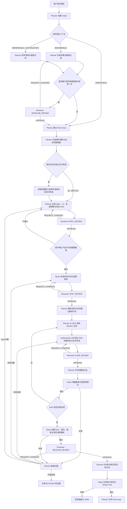

# DevFlow 四角色 Agent 开发技能体系总体设计

> 版本：1.1
> 状态：已实现并验证
> 日期：2026-09-05
> 目标平台：Codex（桌面端、IDE、CLI 共享的本地配置体系）
> 适用项目：前端、后端、全栈、移动端、桌面端、数据工程、AI/Agent、基础设施及多语言仓库

---

## 1. 文档目的

本文是 Skill 开发阶段的总体设计，不应整篇复制进任何运行时 `SKILL.md`。运行时 Skill 必须保持聚焦，并按需读取共享 Reference。

本文用于指导 Codex 开发以下四个角色 Skill：

1. `devflow-planner`：需求分析、仓库接管、方案设计、任务拆分、流程调度和合并协调。
2. `devflow-reviewer`：独立审核仓库基线、Spec、测试方案、代码和发布条件。
3. `devflow-tester`：测试设计、自动化测试、集成验证、真实场景模拟和缺陷报告。
4. `devflow-implementer`：在明确边界内完成单个任务或缺陷的代码实现。

这套体系既要支持从零开发，也必须优先支持以下现实场景：

- 项目已经开发到一半，Agent 中途接手；
- 仓库存在明确或隐含的编码风格；
- 当前分支已经有部分实现；
- 工作区存在其他人尚未提交的修改；
- 原项目存在历史债务、失败测试或不一致写法；
- 用户只要求完成某项功能，不希望 Agent 顺手重构整个项目；
- 目标分支不一定是 `main`，可能是 `develop`、release 分支或已有 feature 分支；
- 项目技术栈、语言、框架和工程规范不可预先写死。

核心目标不是让四个 Agent 机械流转，而是形成一套：

> **可继承原仓库、可控制变更半径、可追踪决策、可独立审核、可验证交付的通用软件开发协议。**

---

## 2. 范围与非目标

### 2.1 本次范围

本设计包含：

- 四个 Skill 的职责、触发方式、输入、输出和禁止事项；
- 四个角色之间的交接协议；
- 新项目与既有项目的统一工作流；
- 中途接管项目的仓库侦察和基线建立机制；
- 原仓库风格继承规则；
- 最小改动、兼容性和变更预算机制；
- Spec、DAG、测试、审核、缺陷和状态文件的结构；
- Git 分支、源分支、Commit SHA 和合并约束；
- 多语言、多框架和多领域的按需审核参考；
- Codex Custom Agent 的建议配置；
- Skill 的人工场景测试和验收标准。

### 2.2 明确不做

本次不得开发：

- DevFlow CLI；
- Python、Node.js、Go、Shell 等流程编排脚本；
- 自定义状态机程序；
- 自定义 Git 包装命令；
- 自定义 CI 平台；
- GitHub、GitLab、Gitea、Linear、Jira 等专属绑定；
- 自动发布、自动部署或生产环境操作能力；
- 用于替代现有 Lint、测试、构建和 CI 的新工具；
- 第五个“总控 Agent”。

四角色协作只通过以下机制完成：

- Codex Skill 指令；
- Codex Custom Agent；
- 仓库已有命令；
- Git 原生命令；
- Markdown/YAML 结构化产物；
- Codex Subagent 调度；
- 人工可读的阶段门禁。

---

## 3. 总体设计原则

### 3.1 继承优先于改造

进入既有仓库时，Agent 的第一职责不是应用自己认为更现代的架构，而是理解项目当前如何工作。

除非用户明确要求重构，否则：

- 原仓库是默认事实源；
- 最近、最相邻、已稳定运行的实现是首选范例；
- 项目现有 Formatter、Linter、类型检查、测试和 CI 规则高于通用偏好；
- 局部一致性通常高于跨仓库的所谓最佳实践；
- 不得把“完成需求”变成“顺手重写项目”。

### 3.2 最小但完整的变更

“最小改动”不是少写代码，而是：

- 只改变需求要求改变的行为；
- 只修改完成该行为所必需的文件；
- 对错误路径、测试、文档和迁移仍要完整；
- 不留下临时实现、硬编码成功、永久 Mock 或未处理边界；
- 不通过缩减验收标准来减少改动。

### 3.3 角色分离

- Planner 不写生产代码，也不审批自己的规划。
- Reviewer 不修改被审核产物。
- Tester 不修复生产代码，也不为了通过而降低测试标准。
- Implementer 不修改已批准的需求，不审核自己，不合并自己。
- 同一个 Root Issue 同一时刻只能有一个 Planner 作为状态所有者。

### 3.4 证据绑定

任何“通过”都必须绑定确定对象：

- Spec 审核绑定 Spec 版本；
- 用户确认绑定 Spec 版本；
- 测试计划审核绑定测试计划版本；
- 代码审核绑定 `base_sha..head_sha`；
- 测试报告绑定 `tested_sha`；
- 发布审核绑定集成分支的精确 SHA；
- 状态文件只能引用仍然有效的审核和报告。

### 3.5 未声明行为默认保持不变

用户确认的 Spec 只定义需要改变的行为。其他未声明行为默认必须保持兼容，包括：

- 公共 API；
- 数据格式；
- 数据库语义；
- 事件格式；
- 配置键；
- 错误码；
- UI 主流程；
- 权限边界；
- 日志和监控依赖的稳定字段；
- 现有调用方依赖的隐式约定。

### 3.6 安全和正确性高于风格继承

不得因为原仓库存在不安全模式就继续复制漏洞。

当原风格与安全、数据正确性或明确的框架约束冲突时：

1. 选择影响面最小的安全实现；
2. 尽量保持外围结构和命名风格一致；
3. 在决策记录中说明为何偏离；
4. 不借机进行无关现代化改造。

### 3.7 过程强度与风险匹配

同一套角色和门禁适用于所有任务，但产物深度按风险调整，避免小任务被流程拖垮，也避免高风险任务被草率处理。

### 3.8 治理成本与信息量匹配

DevFlow 的证据纪律不等于重复制造上下文和产物：

- 在正式审核前解决可通过只读侦察得到的事实，避免 Reviewer 充当逐轮需求发现者；
- Program/Epic 级请求先按可独立用户价值、发布、权限和环境边界分期，原子行为不机械拆分；
- 目标仓库已有等价审批、CI 或发布证据时直接映射引用，不维护两套竞争事实；
- 角色交接只传递精确身份和当前增量，完整内容从持久产物读取；
- 审核一次披露全部可识别阻断项，窄修正使用有界增量复审；
- 等待以事件变化为依据，不通过高频轮询或重放完整对话制造进度。

这些优化不得弱化角色分离、版本/SHA 绑定、安全、用户批准或任何适用 Gate。

---

## 4. 两个正交维度：项目上下文与交付强度

### 4.1 项目上下文

#### `GREENFIELD`

适用于目标范围基本没有既有生产实现的项目或模块。

特点：

- 可以建立新的局部结构；
- 仍需服从仓库已有工具链和上层规范；
- 可以定义新接口，但要保持方案简单；
- 不代表可以默认采用微服务、DDD、CQRS 等复杂架构。

#### `BROWNFIELD`

只要目标仓库或目标模块存在可运行代码、历史约定、部分实现或现有用户，就默认属于 `BROWNFIELD`。

特点：

- 必须先建立仓库基线；
- 必须识别相邻范例和实际风格；
- 必须明确改动半径；
- 必须区分既有失败和新引入失败；
- 默认保持所有未声明行为；
- 默认禁止大规模重构和升级。

#### `BROWNFIELD_CONTINUATION`

这是 `BROWNFIELD` 的重点子类型，适用于：

- 功能已经实现一部分；
- 当前 feature 分支开发到一半；
- 存在 Stub、TODO、Mock 或临时路径；
- 有代码但没有测试或尚未集成；
- 用户要求 Agent 接手其他人留下的工作。

该模式必须额外生成“现状清单”和“差距分析”，不能把已有实现当作空白重新开始。

### 4.2 工作类型

每个 Root Issue 必须标记一种主要工作类型：

```yaml
work_type: feature | continuation | bugfix | migration | refactor | maintenance | infrastructure
```

其中：

- `continuation` 默认启用中途接管规则；
- `refactor` 只有用户明确要求时才能使用；
- 不能把为了完成 Feature 所做的大面积整理偷偷归入 `feature`。

### 4.3 交付强度

#### `FAST`

适用于：

- 文案或局部样式；
- 明确且可复现的小 Bug；
- 单一配置修正；
- 不改变公开契约的局部低风险修改。

仍然执行四角色职责，但可使用 Mini Spec、简化测试计划和单次审核。

#### `STANDARD`

适用于普通前后端功能、多文件修改、新增接口、页面、数据库增量变更和跨模块联动。

执行完整流程。

#### `HIGH_RISK`

适用于：

- 认证、授权、租户隔离；
- 支付、财务、隐私；
- 数据删除和数据迁移；
- 公共 API 或事件契约；
- 高并发、消息一致性；
- 基础设施和生产配置；
- 安全修复；
- 大范围兼容性影响。

必须额外覆盖安全、回滚、迁移、故障和必要的性能场景。

---

## 5. 系统结构

本体系由四层组成：

```text
┌──────────────────────────────────────────────────────────────┐
│  AGENTS.md                                                   │
│  全局及项目级稳定工程规则，所有角色共同遵守                 │
├──────────────────────────────────────────────────────────────┤
│  4 个 Role Skills                                            │
│  Planner / Reviewer / Tester / Implementer                  │
├──────────────────────────────────────────────────────────────┤
│  Shared Contracts & References                               │
│  状态、产物、门禁、Brownfield、语言、架构、安全等共享规范   │
├──────────────────────────────────────────────────────────────┤
│  .devflow/ Runtime Artifacts                                 │
│  每个需求的 Spec、DAG、审核、测试、缺陷、实现和状态证据     │
└──────────────────────────────────────────────────────────────┘
```

Codex 中的职责分工应为：

- `AGENTS.md`：定义每次都适用的稳定工程原则；
- Skill：定义重复执行的角色工作流；
- Custom Agent：限制角色的身份、权限和工作边界；
- `.devflow/`：保存跨 Agent 可交接的事实，不依赖聊天上下文记忆。

---

## 6. 推荐目录结构

```text
repo-root/
├── AGENTS.md
│
├── .agents/
│   └── skills/
│       ├── _devflow_shared/
│       │   ├── contracts/
│       │   │   ├── role-boundaries.md
│       │   │   ├── artifact-lifecycle.md
│       │   │   ├── workflow-state.md
│       │   │   ├── gate-policy.md
│       │   │   ├── review-severity.md
│       │   │   ├── change-control.md
│       │   │   ├── git-policy.md
│       │   │   └── brownfield-policy.md
│       │   │
│       │   ├── templates/
│       │   │   ├── intake.md
│       │   │   ├── repository-profile.md
│       │   │   ├── takeover-assessment.md
│       │   │   ├── root-issue.md
│       │   │   ├── spec.md
│       │   │   ├── ui-spec.md
│       │   │   ├── task.yaml
│       │   │   ├── state.yaml
│       │   │   ├── review.yaml
│       │   │   ├── test-plan.md
│       │   │   ├── test-case.yaml
│       │   │   ├── test-report.yaml
│       │   │   ├── implementation-report.yaml
│       │   │   ├── defect.yaml
│       │   │   ├── decision.md
│       │   │   └── risk-acceptance.md
│       │   │
│       │   ├── references/
│       │   │   ├── repository-discovery.md
│       │   │   ├── minimal-change.md
│       │   │   ├── architecture-review.md
│       │   │   ├── frontend-review.md
│       │   │   ├── backend-review.md
│       │   │   ├── api-review.md
│       │   │   ├── database-review.md
│       │   │   ├── distributed-systems-review.md
│       │   │   ├── security-review.md
│       │   │   ├── devops-review.md
│       │   │   ├── ai-agent-review.md
│       │   │   └── languages/
│       │   │       ├── javascript-typescript.md
│       │   │       ├── python.md
│       │   │       ├── java-kotlin.md
│       │   │       ├── go.md
│       │   │       ├── rust.md
│       │   │       ├── csharp.md
│       │   │       ├── php-ruby.md
│       │   │       ├── shell.md
│       │   │       └── sql.md
│       │   │
│       │   └── evals/
│       │       ├── trigger-cases.md
│       │       ├── workflow-cases.md
│       │       └── brownfield-cases.md
│       │
│       ├── devflow-planner/
│       │   ├── SKILL.md
│       │   ├── references/
│       │   │   ├── requirement-analysis.md
│       │   │   ├── task-decomposition.md
│       │   │   └── orchestration.md
│       │   └── agents/openai.yaml
│       │
│       ├── devflow-reviewer/
│       │   ├── SKILL.md
│       │   ├── references/
│       │   │   ├── baseline-review.md
│       │   │   ├── spec-review.md
│       │   │   ├── test-review.md
│       │   │   ├── code-review.md
│       │   │   └── release-review.md
│       │   └── agents/openai.yaml
│       │
│       ├── devflow-tester/
│       │   ├── SKILL.md
│       │   ├── references/
│       │   │   ├── test-strategy.md
│       │   │   ├── characterization-testing.md
│       │   │   ├── integration-testing.md
│       │   │   └── defect-reporting.md
│       │   └── agents/openai.yaml
│       │
│       └── devflow-implementer/
│           ├── SKILL.md
│           ├── references/
│           │   ├── implementation-workflow.md
│           │   ├── brownfield-implementation.md
│           │   └── self-review.md
│           └── agents/openai.yaml
│
├── .codex/
│   ├── config.toml
│   └── agents/
│       ├── devflow-planner.toml
│       ├── devflow-reviewer.toml
│       ├── devflow-tester.toml
│       └── devflow-implementer.toml
│
└── .devflow/
    ├── README.md
    └── changes/
        └── REQ-YYYYMMDD-001/
            ├── state.yaml
            ├── intake.md
            ├── repository-profile.md
            ├── takeover-assessment.md
            ├── root-issue.md
            ├── decisions.md
            ├── specs/
            ├── ui/
            ├── tasks/
            ├── tests/
            ├── reviews/
            ├── implementations/
            ├── defects/
            └── reports/
```

### 6.1 目录设计说明

- `_devflow_shared` 没有 `SKILL.md`，因此不是第五个 Skill，只是四个 Skill 的共享规范。
- 四个 `SKILL.md` 应保持聚焦，详细检查项按需读取 `references/`。
- 不创建 `scripts/` 目录。
- `.devflow/` 是每个业务仓库运行该流程时生成的工作区。
- Skill 项目自身可以使用这套目录进行自举测试。

---

## 7. 整体工作流



### 7.1 不得写死 `main`

最终目标分支必须来自原仓库事实，例如：

- `main`；
- `master`；
- `develop`；
- `release/*`；
- 已存在的 feature 集成分支；
- Monorepo 中特定团队约定的合并目标。

Planner 必须记录：

```yaml
target_branch:
target_base_sha:
integration_branch:
integration_base_sha:
branch_strategy_source:
```

`branch_strategy_source` 应指出分支策略来自哪里，例如 `CONTRIBUTING.md`、CI、近期 PR、用户明确要求或仓库既有命名。

### 7.2 首次 G2 前的事实预检与分期

在第一次正式 `SPEC_REVIEW` 前，Planner 必须有界核对所有会改变 Spec、测试计划或 Task 边界的可发现事实：目标仓库规则、真实执行入口、依赖/生成器版本、数据和供应商能力、安全/权限边界、实际验证命令、环境可用性和当前授权。能从代码、配置、锁文件、CI、契约或安全本地探针确认的内容，不能留给 Reviewer 在多轮正式审核中逐条发现。

无法安全确认的事项要写成假设、受影响验证切片或带解除条件的阻塞项。正式审核前可以在草稿内继续完善，不能用发布多个正式版本代替预检。

请求出现以下任一情况时，应在 G2 前拆成独立 Root Issue 或交付阶段：多个能够独立产生用户价值且可独立验收的部分；不同发布、权限或环境边界；无法通过紧凑身份与产物引用形成单一审核包。拆分必须保留完整能力清单、阶段依赖、延期项和最终完成条件。必须作为原子事务或兼容切换验收的行为保持为一个 Root Issue，不按文件或任意数量阈值拆分。

### 7.3 与目标仓库流程组合

Planner 在 Repository Profile 的现有章节中记录仓库 Issue、设计批准、测试/CI、发布和状态事实与 G0–G10 的对应关系。只有语义范围、独立决策所有者、版本/完整 SHA、时效性和证据可读性等价时，现有证据才能直接满足 DevFlow Gate；`state.yaml` 引用原始路径或身份，不复制同一内容。规则不等价或冲突时执行更严格的一项，并记录依据。

### 7.4 紧凑交接、等待与审核收敛

所有角色交接只传递 Root Issue、单一动作/模式、目标路径与版本、适用 SHA、当前 Finding/Defect、允许/保护路径、预期输出、首个检查点和停止条件。完整事实从持久产物读取。在平台支持时默认关闭完整对话继承，例如 `fork_turns: "none"`；只有当前增量无法由产物身份表达时才附带最少近期上下文。

Planner 应使用带 cursor/revision 的事件式长等待。状态未变化时不得反复读取任务、重发 Prompt 或仅因没有 commentary 中断。只有明确偏离、超过已声明预算仍无进展、等待用户、工具挂起或角色越权时才中断，并从状态、产物、SHA 和未关闭 Finding/Defect 恢复。

Reviewer 对可审核对象必须在一轮完成全部适用维度并披露当时可识别的全部 P0/P1/P2 Finding。窄修正默认由仍保持独立的原 Reviewer 审核 Delta、原 Finding 和受影响邻域；行为、架构或风险面显著变化时完整复审。同一产物/模式连续两次 `REQUEST_CHANGES` 未收敛时，Planner 先暂停送审并完成根因汇总和针对性修正。该规则与三轮同一 Defect 规则分别计数。

---

## 8. Brownfield 与中途接管协议

这是本设计最重要的部分。

### 8.1 进入条件

满足任一条件时，Planner 必须启用 Brownfield 规则：

- 仓库存在业务代码；
- 目标模块已有实现；
- 当前分支不是初始分支；
- 存在历史提交；
- 存在测试、迁移、公共 API 或已有用户；
- 用户明确表示项目已开发一部分；
- 工作区存在未提交修改；
- 需求是修复、延续、迁移或局部增强。

不得因为项目规模小就默认当作 Greenfield。

### 8.2 接管前置侦察

Planner 在任何设计和修改前，至少完成以下侦察：

1. 确认 Git 根目录、当前分支、HEAD、上游和工作区状态。
2. 读取生效的全局、仓库级和目录级 `AGENTS.md` / `AGENTS.override.md`。
3. 读取 README、CONTRIBUTING、架构文档、ADR 和目标模块说明。
4. 检查语言版本、锁文件、构建系统、包管理器、Formatter、Linter、类型检查和 CI。
5. 定位入口、调用链、数据模型、公共接口、权限边界和部署方式。
6. 找到与目标需求最相似的 2～3 个稳定实现作为“参考样本”。
7. 找到相邻测试、Fixture、Mock、迁移和错误处理范例。
8. 检查当前分支已经完成、部分完成、占位、废弃和未知的工作。
9. 执行可行的基线检查，记录原始通过和失败情况。
10. 识别生成代码、Vendored 代码、锁文件和不可直接修改区域。

侦察必须是定向的，不要求无目的读取整个仓库。

### 8.3 仓库事实优先级

当风格或行为信息冲突时，按以下顺序判断：

1. 用户当前明确要求和已批准 Spec；
2. 当前目录生效的 `AGENTS.override.md` / `AGENTS.md`；
3. Formatter、Linter、编译器、类型检查、测试和 CI 的强制规则；
4. 公共契约、数据库约束和真实运行路径；
5. 目标模块相邻且近期稳定的实现；
6. 仓库范围内的多数一致写法；
7. README、Wiki 和历史文档；
8. 通用工程建议。

文档与运行代码冲突时，Planner 必须记录冲突，而不是偷偷选择对自己方便的一方。

### 8.4 风格画像

`repository-profile.md` 必须记录目标区域的真实风格，不只列出技术栈。

至少包括：

- 目录和模块组织；
- 命名规则；
- 导入顺序；
- Controller、Service、Domain、Repository 等边界；
- 依赖注入方式；
- 错误和返回值模型；
- 日志结构；
- 配置读取方式；
- 异步、并发、事务和重试方式；
- 测试框架、命名、Fixture 和 Mock 风格；
- 前端组件、状态管理、数据请求和样式体系；
- API、DTO、序列化和版本策略；
- Migration 和数据访问模式；
- 已知例外和不一致区域；
- 参考文件和参考符号。

示例：

```yaml
style_profile:
  source_files:
    - path: src/modules/orders/order-service.ts
      reason: 与目标业务最相近的稳定 Service
    - path: src/modules/orders/order-controller.ts
      reason: 当前项目标准接口与错误映射
    - path: tests/orders/order-service.test.ts
      reason: 当前模块测试范式
  enforced_by:
    formatter: biome.json
    linter: eslint.config.js
    typecheck: tsconfig.json
    ci: .github/workflows/check.yml
  local_patterns:
    error_model: Result + typed domain errors
    dependency_injection: constructor injection
    tests: table-driven cases with test builders
    api_response: existing envelope must be preserved
  inconsistencies:
    - 新模块使用 Result，旧模块仍抛出字符串异常
  chosen_rule:
    - 目标区域延续 Result 风格，不改造旧模块
```

### 8.5 现状清单与差距分析

`BROWNFIELD_CONTINUATION` 必须将已有工作分类：

```text
ACCEPTED_COMPLETE     已完成、符合目标且已验证
COMPLETE_UNVERIFIED   看似完成，但缺少测试或验收证据
PARTIAL               只完成部分路径
STUB                   占位实现、固定返回、临时 Mock
CONFLICTING            与当前需求或契约冲突
ABANDONED              已废弃但仍残留
UNKNOWN                暂时无法确认用途
NOT_STARTED            尚未开始
```

Planner 必须回答：

- 当前功能已经能做到什么；
- 哪些代码可以直接保留；
- 哪些代码只需要补全；
- 哪些代码必须最小范围修正；
- 哪些内容不属于本需求；
- 哪些旧代码即使不理想也不应在本次修改；
- 哪些风险会影响继续开发；
- 继续当前方案与重写相比为何更合适。

默认策略是：

> **优先延续和补全已有垂直链路，不重写已经可工作的部分。**

### 8.6 变更预算

每个 Brownfield Root Issue 必须定义 `change_budget`：

```yaml
change_budget:
  change_radius: local | cross_module | system
  allowed_paths: []
  protected_paths: []
  public_contract_changes: none | additive | approved_breaking
  database_changes: none | additive | migration_required
  dependency_changes: forbidden | approved_only
  framework_upgrade: forbidden | separately_approved
  build_system_changes: forbidden | separately_approved
  broad_rename_or_move: forbidden | separately_approved
  formatting_scope: touched_lines_or_files_only
  generated_files: generator_only
  refactor_policy: required_only
  max_parallel_writers_per_area: 1
```

默认值必须保守：

- 禁止框架升级；
- 禁止包管理器和构建工具迁移；
- 禁止全仓库格式化；
- 禁止大范围重命名和移动；
- 禁止无需求依据的公共接口修改；
- 禁止新增生产依赖，除非现有能力确实无法满足；
- 禁止为了一个调用点建立通用框架；
- 禁止修复所有历史技术债务。

### 8.7 重构防火墙

所有重构建议必须分类：

| 类别 | 定义 | 默认处理 |
|---|---|---|
| `REQUIRED` | 不做就无法安全、正确完成当前需求 | 可纳入，但必须写入 Spec 和变更预算 |
| `INCIDENTAL` | 极小、低风险且直接减少当前改动复杂度 | Reviewer 判断是否允许 |
| `OPPORTUNISTIC` | 只是顺手清理、现代化或个人偏好 | 禁止混入当前任务，记录为后续建议 |

Implementer 不得以“代码质量”为由自行扩大改动。

Reviewer 也不得把大规模现代化建议作为当前 Feature 的阻断项，除非存在真实的正确性、安全性或可发布性风险。

### 8.8 工作区保护

发现未提交修改时：

- 不得自动 `reset`、`clean`、`checkout --`、丢弃或覆盖；
- 不得擅自将他人的修改提交到自己的分支；
- 不得自动 Stash 后假装工作区原本干净；
- 必须记录修改文件和与当前任务的重叠情况；
- 无重叠时，可从明确的已提交 SHA 建立独立 Worktree 或分支继续；
- 有重叠且无法安全隔离时，Planner 必须将其作为阻塞或请求用户明确处理方式；
- 最终交付必须区分“任务前已有修改”和“本次 Agent 修改”。

### 8.9 基线失败

接管既有项目时，测试或构建可能原本就失败。

必须记录：

```yaml
baseline_checks:
  - command:
    sha:
    result: pass | fail | blocked
    classification: clean | pre_existing | environment | unknown
    evidence:
```

规则：

- 不得把所有基线失败都算作本次变更失败；
- 不得把本次新失败伪装成历史失败；
- 本次变更不得扩大原失败范围；
- 目标代码路径必须有可验证证据；
- 与需求无关的历史失败只记录，不顺手修复；
- 如果受影响路径本身无法建立可信基线，应先增加最小特征测试或请求风险确认。

### 8.10 特征测试

当既有行为缺少测试但必须保持时，Tester 应优先建立 Characterization Test：

- 捕获当前真实、需要保持的可观察行为；
- 不把明显 Bug 固化为永久契约；
- 只覆盖受影响边界；
- 不生成巨大脆弱快照；
- Spec 明确要求改变的行为不应被旧行为测试阻挡；
- 测试名称应说明它保护的兼容性。

---

## 9. 角色一：Planner

### 9.1 定位

Planner 是：

- 用户需求入口；
- 唯一流程协调者；
- 唯一全局状态写入者；
- 仓库接管负责人；
- Spec、UI、DAG 和变更预算负责人；
- 正式审核前的事实预检、交付规模判断和仓库流程映射负责人；
- 分支来源和合并顺序负责人；
- 紧凑交接、等待恢复和审核收敛负责人；
- 缺陷归因负责人；
- 最终关闭 Root Issue 的角色。

Planner 不是生产代码实现者，也不是审核者。

### 9.2 触发方式

Planner 是四个 Skill 中唯一允许隐式触发的 Skill。

建议 Frontmatter：

```yaml
---
name: devflow-planner
description: 接收软件开发、修复、续接既有项目、重构、迁移或基础设施需求；先识别仓库上下文和风险，再建立 Root Issue、Spec、UI、变更预算与任务 DAG，并协调 Reviewer、Tester 和 Implementer 完成交付。非开发任务不要触发。
---
```

`agents/openai.yaml`：

```yaml
interface:
  display_name: DevFlow Planner
  short_description: 规划并协调完整的软件开发流程
policy:
  allow_implicit_invocation: true
```

实现时删除无效空字段，只保留 Codex 当前支持的合法配置。

### 9.3 强制输入

Planner 必须收集或推断：

- 用户目标；
- 完成条件；
- 仓库路径；
- 当前分支和工作区状态；
- 项目上下文；
- 工作类型；
- 风险等级；
- 目标分支；
- 相关设计、Issue、日志或截图；
- 用户明确禁止事项。

无法确定的低风险内部细节应采用保守假设，不要频繁打断用户。

只有下列歧义才应询问：

- 会导致两种明显不同的产品行为；
- 会改变公开 API、数据模型、权限或兼容策略；
- 涉及不可逆数据操作；
- 涉及生产发布、账号凭据或付费；
- 无法判断应续接哪个分支或是否包含未提交修改；
- 继续实现与重写之间存在重大成本或风险差异。

### 9.4 Planner 工作阶段

#### 阶段 A：Intake

输出 `intake.md`：

- 原始需求；
- 一句话目标；
- 用户价值；
- 明确约束；
- 初始完成条件；
- 需要澄清的问题；
- 初始假设。

#### 阶段 B：模式识别

确定：

```yaml
project_context:
work_type:
delivery_mode:
risk_level:
```

#### 阶段 C：仓库侦察

Brownfield 时输出：

- `repository-profile.md`；
- `takeover-assessment.md`；
- 基线测试结果；
- 参考实现清单；
- 当前工作清单；
- 变更风险。

同时识别仓库既有 Issue、设计、测试/CI、发布和状态协议，记录与 G0–G10 的等价证据及冲突处理；区分合成/Mock、本地真实边界、集成、live 和生产环境的能力与授权。然后完成会改变 Spec、测试或 Task 边界的事实预检。

#### 阶段 D：Root Issue

`root-issue.md` 至少包含：

- 背景和问题；
- 目标；
- 用户价值；
- 范围；
- 非目标；
- 保持不变的行为；
- 约束；
- 风险；
- 完成标准；
- 依赖；
- 回滚方向。

若原始请求被分期，还必须保留完整能力清单、当前阶段、延期项、跨阶段依赖和最终完成条件，不能把后续能力静默写成永久非目标。

#### 阶段 E：Spec 与 UI

Spec 至少包含：

```yaml
problem:
goals:
non_goals:
current_behavior:
desired_behavior:
preserved_behavior:
user_flows:
business_rules:
acceptance_criteria:
api_contracts:
data_model:
permission_model:
error_behavior:
compatibility:
security:
performance:
observability:
migration:
rollback:
ui_states:
assumptions:
risks:
open_questions:
```

UI 仅在需求包含界面时生成，且 Brownfield 项目必须优先复用现有设计系统、组件和交互模式。

#### 阶段 F：任务 DAG

每个任务必须：

- 单一职责；
- 可独立实现；
- 可独立审核；
- 可独立验证；
- 明确依赖；
- 明确源 SHA；
- 明确允许修改范围；
- 明确验收标准；
- 明确交付物；
- 明确风险；
- 明确验证环境层级、所需授权和低权威结果不能证明的事项；
- 不形成循环依赖。

一组行为若有独立用户价值以及独立发布、权限、环境或验收边界，应先拆成 Root Issue/交付阶段，而不是放入巨大 DAG。不可用环境对应的验证若可独立验收，应拆成单独切片；不可拆分的必需权限或环境缺失时，Task 保持 `BLOCKED`。

示例：

```yaml
id: TASK-003
title: 完成重复邮箱注册冲突处理
spec_version: 3
acceptance_criteria:
  - AC-002
depends_on:
  - TASK-001
base_policy: latest_verified_integration_sha
allowed_paths:
  - backend/src/modules/auth/**
  - backend/tests/auth/**
protected_paths:
  - backend/src/shared/error-contract.ts
reference_implementations:
  - backend/src/modules/account/account-service.ts
expected_deliverables:
  - 数据库唯一性处理
  - 稳定错误映射
  - 回归测试
verification_expectations:
  - 模块单元测试
  - 注册接口集成测试
risk: medium
```

#### 阶段 G：调度

Planner 只调度依赖完成且不存在写入冲突的任务。

每次委派使用第 7.4 节的紧凑交接，从持久产物恢复而不是传递完整对话；等待基于事件变化。若一个角色仍需大量互不相关材料才能开始，应先缩小审核或 Task。

并行条件：

- DAG 无依赖；
- 修改区域不重叠；
- 不共同修改公共契约；
- 不共同修改同一数据库对象；
- 不共同修改构建文件或共享配置；
- 每个写入区域只有一个 Implementer。

#### 阶段 H：缺陷归因

测试失败后，Planner 分类为：

- `SPEC`；
- `TEST`；
- `IMPLEMENTATION`；
- `ENVIRONMENT`；
- `BASELINE`；
- `SCOPE_CHANGE`；
- `UNKNOWN`。

不能默认全部交给 Implementer。

审核修正使用稳定 Finding ID 逐项记录 `resolved`、`unresolved`、`accepted` 或 `not_applicable` 及证据；`accepted` 只适用于具有当前有效风险接受的 P2，P0/P1 不能接受后放行。同一产物和模式连续两次请求修改仍未收敛时，先判断根因属于事实预检、Spec 结构、测试模型、架构约束还是范围失控，完成修正后再送审。

#### 阶段 I：合并和关闭

Planner 负责：

- 检查审核和测试证据是否仍有效；
- 按 DAG 拓扑顺序合并；
- 每次合并后触发增量集成测试；
- 最终集成通过后合并到实际目标分支；
- 目标分支 Smoke Test 通过后关闭 Root Issue。

### 9.5 Planner 禁止事项

- 不写生产代码；
- 不直接修复冲突代码；
- 不审批自己的 Spec；
- 不宣布未经 Tester 验证的功能完成；
- 不将任务分支绕过集成流程直接合并到目标分支；
- 不假设目标分支一定是 `main`；
- 不擅自处理未提交代码；
- 不擅自扩大变更预算；
- 不为赶进度降低验收标准；
- 不同时启动第二个 Planner 管理同一 Root Issue。

---

## 10. 角色二：Reviewer

### 10.1 定位

Reviewer 是独立质量门禁，只读取和验证，不修改被审核对象。

建议将 Custom Agent 设置为 `read-only`。需要生成构建产物的测试由 Tester 或 Implementer 执行，Reviewer 主要复核证据、Diff 和真实代码路径。

### 10.2 触发方式

Reviewer 默认禁止隐式触发，只允许用户明确调用或 Planner 明确委派。

```yaml
---
name: devflow-reviewer
description: 独立审核 DevFlow 的仓库基线、Spec、测试计划、代码提交或发布准备状态；必须基于文件和版本证据输出结构化结论，不修改被审核产物，不用于实现功能。
---
```

```yaml
policy:
  allow_implicit_invocation: false
```

### 10.3 审核模式

Reviewer 必须明确选择一种模式：

```text
BASELINE_REVIEW
SPEC_REVIEW
TEST_REVIEW
CODE_REVIEW
RELEASE_REVIEW
```

#### 10.3.1 `BASELINE_REVIEW`

重点用于中途接管：

- 是否读取了正确作用域的项目规范；
- 当前分支、目标分支和基线 SHA 是否合理；
- 未提交修改是否被保护；
- 技术栈和版本是否来自仓库事实；
- 参考实现是否与目标区域真正相近；
- 风格画像是否有文件证据；
- 基线失败是否真实记录；
- 现状清单是否区分完成、部分和占位实现；
- 是否遗漏关键调用链、公共契约或数据边界；
- 是否出现未侦察就建议重写的倾向。

#### 10.3.2 `SPEC_REVIEW`

审查：

- 是否解决真实需求；
- 当前行为、目标行为和保持行为是否分开；
- 范围和非目标是否清楚；
- 验收标准是否可观察、可测试；
- API、数据、权限和错误语义是否一致；
- UI 是否符合已有设计系统；
- 是否覆盖加载、空、错误、成功、无权限和极端状态；
- 是否有迁移和回滚策略；
- DAG 是否合理；
- Brownfield 变更预算是否足够小；
- 是否存在不必要的重构、升级、依赖或设计模式；
- 是否会破坏原项目未声明行为。
- 会改变边界的可发现事实是否已在正式送审前完成预检；
- 大型请求是否保留完整能力清单并按独立价值/发布/权限/环境边界合理分期；
- 仓库既有流程证据是否被正确映射而非重复制造。

#### 10.3.3 `TEST_REVIEW`

审查：

- 每条验收标准是否映射到测试；
- 正常、异常、边界和恢复路径；
- 权限、租户、并发、超时、重试和幂等；
- 数据迁移和兼容性；
- UI 浏览器和设备场景；
- 测试数据可重复性和清理；
- 是否只验证实现细节；
- 是否遗漏 Brownfield 特征测试；
- 是否正确区分基线失败；
- 是否有足够证据定位失败。
- 是否区分合成/Mock、本地、集成、live 和生产授权层级；
- 低权威结果是否被错误用于替代必需的真实边界验证；
- 环境缺失是否被限定到可独立切片，或在不可拆分时正确阻塞。

#### 10.3.4 `CODE_REVIEW`

审核对象必须包含：

```yaml
base_sha:
head_sha:
task_id:
spec_version:
implementation_report:
```

审核维度包括：

##### 正确性

- 是否完整实现验收标准；
- 边界、空值、错误和部分失败；
- 事务、并发、顺序、幂等和资源释放；
- 真实调用链是否正确；
- 是否存在被吞异常、固定成功或无效兜底。

##### 兼容性

- 公共 API、DTO、事件、配置和数据库格式；
- 旧调用方；
- 旧客户端；
- 滚动升级；
- 序列化和枚举；
- 未声明行为是否保持。

##### Brownfield 最小性

- 是否只修改允许路径；
- 是否出现无关格式化；
- 是否产生大范围 Rename 或 Move；
- 是否无理由修改锁文件；
- 是否引入新依赖；
- 是否替换现有框架或模式；
- 是否重复实现仓库已有能力；
- 是否与参考实现风格一致；
- 是否改变用户已有修改；
- Diff 是否超出变更预算。

##### 架构与设计

- 模块职责和依赖方向；
- 抽象是否由真实变化点驱动；
- 是否错误套用设计模式；
- 是否引入循环依赖；
- 是否出现跨层访问；
- 是否有更简单且符合原仓库的实现。

##### 安全

- 认证、授权、资源归属和租户隔离；
- 注入、XSS、CSRF、SSRF、路径穿越；
- 文件上传；
- Secret 和敏感日志；
- 默认配置安全；
- 依赖供应链；
- 不安全反序列化。

##### 数据

- 约束、索引、事务和锁；
- Migration 可升级和可恢复；
- N+1、全表扫描和不稳定分页；
- 精度、时区和字符集；
- 删除、归档和审计。

##### 性能与可靠性

- 复杂度；
- 网络调用和请求瀑布；
- 内存和大对象；
- 超时、重试、退避、限流和熔断；
- 缓存一致性；
- 消息重复、乱序和死信；
- 优雅关闭。

##### 可观测性

- 结构化日志；
- 稳定事件名；
- 关键指标；
- Trace 传播；
- 错误上下文；
- 告警和排障能力。

##### 测试

- 单元和组件测试是否覆盖真实行为；
- 是否缺少失败路径；
- 是否过度 Mock；
- 是否存在脆弱快照；
- 是否有时间、随机和外部服务导致的不稳定；
- 回归测试是否能证明缺陷修复。

#### 10.3.5 `RELEASE_REVIEW`

审查：

- 所有任务是否已验证；
- 所有审核是否绑定当前版本；
- 集成测试是否对应当前集成 SHA；
- 是否有未解决 P0/P1；
- P2 是否已解决或获得明确风险接受；
- Migration、配置、回滚和文档；
- Feature Flag 生命周期；
- 目标分支是否正确；
- 是否存在未记录的 Brownfield 基线失败；
- 是否可以安全进入目标分支。

### 10.4 Reviewer 输出

只允许以下 Verdict：

```text
APPROVE
REQUEST_CHANGES
BLOCKED
```

不使用模糊的“基本通过”。非阻断建议使用 P3 Finding。

```yaml
review_id: REVIEW-017
mode: CODE_REVIEW
target:
  task_id: TASK-003
  spec_version: 3
  base_sha: abc123
  head_sha: def456
verdict: REQUEST_CHANGES
findings:
  - id: FINDING-001
    severity: P1
    category: correctness
    location: src/auth/register.ts:83
    evidence: 应用层先查后写，在并发请求下不能保证唯一性
    impact: 可能创建重复用户
    required_change: 使用数据库唯一约束并映射冲突错误
non_blocking_notes:
  - 可在后续独立任务统一旧模块错误模型
residual_risks:
  - 邮件服务在集成环境中仍使用模拟实现
```

Reviewer 对一个可以可信审核的对象必须完成所有适用维度，并在同一轮返回当时可识别的全部 P0/P1/P2 Finding；不能发现第一项问题后提前停止，再在后续版本逐条释放。缺少版本、SHA、权限或关键证据时使用 `BLOCKED`；对象可审核但存在 Finding 时使用 `REQUEST_CHANGES`，二者不得混用。

每个 Finding 使用稳定 ID。窄修正默认由仍保持独立且可用的原 Reviewer 复审上一 Review、精确 Delta、待关闭 Finding 和受影响邻域，并以新 Review `supersedes` 旧 Review。Reviewer 不可用、有职责冲突，或修订改变行为、架构或风险面时执行完整复审。

### 10.5 严重程度

| 等级 | 定义 | 是否阻断 |
|---|---|---|
| P0 | 安全事故、数据损坏、严重生产风险 | 必须阻断 |
| P1 | 功能错误、关键回归、关键测试缺失 | 必须阻断 |
| P2 | 明确的可维护性、可靠性或一般风险 | 默认阻断，可显式接受 |
| P3 | 非阻断建议或后续优化 | 不阻断 |

### 10.6 Reviewer 禁止事项

- 不修改 Spec、测试和生产代码；
- 不审核自己创建或改过的产物；
- 不以个人偏好替代仓库约定；
- 不为了展示能力制造无意义意见；
- 不要求当前需求承担整个仓库技术债务；
- 不把安全风险降级为纯风格建议；
- 不在没有精确版本或 SHA 时批准；
- 不以“测试说通过”替代代码路径审查。

---

## 11. 角色三：Tester

### 11.1 定位

Tester 从用户行为和系统行为角度证明需求是否真正完成。

Tester 负责：

- 测试策略；
- 验收标准追踪矩阵；
- 特征测试；
- 契约测试；
- 集成测试；
- E2E；
- UI 浏览器测试；
- 探索测试；
- 回归测试；
- 必要的性能和安全场景；
- 缺陷证据；
- 最终真实使用模拟；
- 合并后的 Smoke Test。

### 11.2 触发方式

默认禁止隐式触发。

```yaml
---
name: devflow-tester
description: 为已批准的 DevFlow Spec 设计并执行测试，维护验收追踪矩阵，完成特征、契约、集成、E2E、回归和真实场景验证，输出绑定 Commit SHA 的测试报告与缺陷证据；不修改生产代码。
---
```

```yaml
policy:
  allow_implicit_invocation: false
```

### 11.3 测试职责边界

| 测试类型 | 主要责任 |
|---|---|
| 单元测试 | Implementer |
| 组件测试 | Implementer |
| 模块内集成测试 | Implementer 为主，Tester 复核 |
| Characterization Test | Tester 为主 |
| API 契约测试 | Tester |
| 跨模块集成测试 | Tester |
| E2E | Tester |
| UI 浏览器测试 | Tester |
| 探索测试 | Tester |
| Smoke Test | Tester |
| 性能/安全专项 | Tester 规划并执行适用部分，Reviewer 复核 |

### 11.4 Tester 工作阶段

#### 阶段 A：基线测试

Brownfield 时：

- 在修改前运行可行的相关检查；
- 记录 SHA、环境、命令和结果；
- 分类历史失败；
- 建立受影响行为基线；
- 必要时增加特征测试。

#### 阶段 B：测试计划

测试计划至少包含：

- 范围和非范围；
- 风险；
- 环境；
- 测试数据；
- 验收追踪矩阵；
- 测试层级；
- 正常、异常、边界和恢复路径；
- 兼容性和回归范围；
- 自动化计划；
- 不执行项及原因；
- 退出条件。

对每个必需行为标注验证权威层级：合成/Mock、本地真实边界、集成环境、live 服务或生产授权验证。记录每层的前置服务、配置、权限、可观察证据和不能证明的事项。低层结果不得替代 Spec 要求的高权威证据；可独立的不可用环境切片局部阻塞，不可拆分的必需前提缺失则计划不得获批进入实现。

#### 阶段 C：测试实现

实现前可以先完成测试设计，不要求在接口不稳定时预写全部自动化代码。

合理顺序：

1. Spec 通过后完成测试设计；
2. Implementer 完成单元和组件测试；
3. 接口稳定后 Tester 完成契约、集成和 E2E；
4. 合并任务后执行增量验证；
5. 全部任务完成后执行完整验证。

#### 阶段 D：缺陷报告

```yaml
defect_id: DEFECT-007
found_on_sha: 12ab34cd
severity: P1
affected_acceptance_criteria:
  - AC-002
environment:
preconditions:
reproduction_steps:
expected:
actual:
evidence:
  logs:
  screenshots:
  network:
suspected_category: implementation | spec | test | environment | baseline | unknown
status: OPEN
```

Tester 只提供 `suspected_category`，最终归因由 Planner 决定。

#### 阶段 E：测试报告

```yaml
test_report_id: TEST-021
tested_sha: def456
spec_version: 3
test_plan_version: 2
environment:
summary:
  passed:
  failed:
  blocked:
commands:
acceptance_criteria_results:
regression_results:
baseline_comparison:
open_defects:
not_run:
residual_risks:
verdict: PASS | FAIL | BLOCKED
```

报告必须明确实际环境和权威层级，结论仅覆盖真实执行范围。Mock、本地或合成结果不得表述为 live、生产或完整 E2E 通过。

### 11.5 Tester 禁止事项

- 不修改生产代码；
- 不修改 Spec 以迁就当前实现；
- 不删除或弱化失败断言；
- 不使用无限重试、忽略、Skip 或扩大超时掩盖问题；
- 不把环境失败误报为代码通过；
- 不把历史失败全部归咎于当前任务；
- 不把当前新失败标记为历史失败；
- 不只测试 Happy Path；
- 不在未执行时声称通过。

---

## 12. 角色四：Implementer

### 12.1 定位

Implementer 每次只负责一个已批准的 Task 或一个已归因的实现缺陷。

Implementer 对实现完整性负责，但不对需求定义、审核和合并负责。

### 12.2 触发方式

默认禁止隐式触发。

```yaml
---
name: devflow-implementer
description: 实现已经通过规划和测试审核的单个 DevFlow Task 或已归因为实现问题的 Defect；严格遵循原仓库风格、源分支、允许路径和变更预算，添加必要测试并提交验证证据，不负责审核或合并。
---
```

```yaml
policy:
  allow_implicit_invocation: false
```

### 12.3 开始前检查

Implementer 必须确认：

- Root Issue ID；
- 当前 Spec 版本；
- Task 或 Defect ID；
- 验收标准；
- 测试计划；
- 依赖任务状态；
- 源分支；
- 源 Commit SHA；
- 当前 Worktree；
- 允许路径和保护路径；
- 风格画像；
- 参考实现；
- 当前目录生效的 AGENTS；
- 构建、测试、Lint 和格式化命令；
- Brownfield 基线失败。

这些输入通过路径、版本和不可变身份引用；Implementer 不要求完整对话历史，也不得从聊天摘要推测缺失的 Spec、批准、权限或 SHA。若必需验收只能在当前无权访问的 live/生产环境完成且无法拆分，必须在编辑生产代码前 `BLOCKED`，不能以 Mock 成功替代。

任一关键版本不匹配时，不得继续实现。

### 12.4 实现顺序

1. 定位真实执行路径，不从文件名猜测。
2. 阅读风格画像和参考实现。
3. 确认已有代码中可复用和需补全的部分。
4. 选择最小、完整、符合仓库模式的方案。
5. 先处理契约、数据和权限边界。
6. 实现主要行为。
7. 实现失败、恢复和边界路径。
8. 添加单元、组件和必要模块集成测试。
9. 更新必要文档、Migration、日志和指标。
10. 运行局部验证。
11. 运行受影响范围验证。
12. 检查 Diff、工作区和无关改动。
13. 固定 Commit SHA。
14. 输出实现报告并交给 Reviewer。

### 12.5 Brownfield 实现规则

- 最近且相邻的稳定实现优先于个人偏好；
- 不为统一风格修改无关旧代码；
- 不引入仓库没有使用的新框架；
- 不替换错误模型、状态管理、ORM、测试框架或构建工具；
- 不做跨模块抽象，除非 Spec 明确批准；
- 不全仓库格式化；
- 不触碰保护路径；
- 不更改锁文件，除非依赖变更已批准；
- 不修改用户已有未提交内容；
- 必要安全偏离必须最小化并记录；
- 发现历史债务只记录到后续建议，不混入当前 Diff；
- 对部分实现优先补全，不从头复制出第二套逻辑。

### 12.6 设计模式规则

不得为了“代码高级”使用设计模式。

只有出现真实问题时才采用：

- Adapter：隔离第三方或遗留接口；
- Strategy：确实存在多个可替换策略；
- Factory：创建过程复杂或依赖运行时条件；
- Builder：参数很多且需要保证构造合法；
- Middleware/Decorator：已有框架支持且适合横切能力；
- State：存在明确状态迁移；
- Repository：领域确需隔离持久化语义；
- Outbox/Inbox：事务与消息可靠一致确有需求；
- Saga：跨服务长事务无法用单一事务解决；
- CQRS：读写模型差异确实足以抵消复杂度。

Brownfield 项目已有模式时，优先延续已有模式；但不得复制已知安全漏洞或错误抽象。

### 12.7 实现报告

```yaml
implementation_id: IMPL-009
task_id: TASK-003
spec_version: 3
base_sha: abc123
head_sha: def456
change_budget_compliance:
  allowed_paths_only: true
  dependency_changes: none
  public_contract_changes: none
changed_files:
summary:
reused_existing_patterns:
design_decisions:
tests:
  - command:
    result:
    exit_code:
documentation:
migrations:
rollback:
known_risks:
not_run:
pre_existing_failures_observed:
```

### 12.8 Implementer 禁止事项

- 不修改已批准的验收标准；
- 不扩大任务范围；
- 不合并自己的分支；
- 不关闭自己的缺陷；
- 不删除失败测试；
- 不以临时 Hack 冒充完成；
- 不伪造测试结果；
- 不在源 SHA 不正确时继续；
- 不隐藏残余风险；
- 不擅自修复无关技术债务；
- 不修改 Reviewer 或 Tester 的历史报告。

---

## 13. 状态与产物协议

### 13.1 单一状态写入者

只有 Planner 可以修改 `.devflow/changes/<REQ>/state.yaml`。

其他角色只能：

- 读取状态；
- 创建自己的新产物；
- 不修改其他角色已经发布的产物；
- 发现状态不一致时返回 `BLOCKED`。

### 13.2 产物不可变

规划类草稿在尚未送交独立 Reviewer、未产生独立结论且未被状态引用时，可以原地完善；内部预检和自审不制造正式版本。产物一旦送审、产生结论或被 `state.yaml` 引用，即视为发布并冻结，无论审核结果是否通过。

审核、测试报告和实现报告一旦发布，不得覆盖修改。

需要修正时创建新版本：

```yaml
id: REVIEW-018
supersedes: REVIEW-017
```

`state.yaml` 更新为指向最新有效产物。

局部修订只发布实际变化的产物。未变化的 Root Issue、仓库画像、Review、测试证据或 Decision 保持原路径和身份，由新产物引用，不复制整套材料。

### 13.3 Root Issue 状态

```text
DRAFT
  ↓
REPOSITORY_BASELINE        Brownfield 条件状态
  ↓
SPEC_REVIEW
  ↓
USER_APPROVAL
  ↓
TEST_REVIEW
  ↓
READY
  ↓
IMPLEMENTING
  ↓
INTEGRATING
  ↓
FULL_VALIDATION
  ↓
RELEASE_REVIEW
  ↓
READY_TO_MERGE
  ↓
POST_MERGE_VERIFY
  ↓
DONE
```

辅助状态：

```text
BLOCKED
CHANGE_REQUESTED
CANCELLED
ROLLED_BACK
```

### 13.4 Task 状态

```text
PLANNED
  ↓
READY
  ↓
IN_PROGRESS
  ↓
CODE_REVIEW
  ↓
APPROVED
  ↓
MERGED
  ↓
INTEGRATION_TEST
  ↓
VERIFIED
  ↓
DONE
```

辅助状态：

```text
BLOCKED
REWORK
CANCELLED
SUPERSEDED
```

### 13.5 `state.yaml` 建议结构

```yaml
schema_version: 1

root_issue:
  id: REQ-20260903-001
  title:
  status: IMPLEMENTING
  project_context: BROWNFIELD_CONTINUATION
  work_type: continuation
  delivery_mode: STANDARD
  risk_level: medium

repository:
  root:
  target_branch: develop
  target_base_sha: 41c3dbe
  integration_branch: feature/REQ-20260903-001
  integration_sha: 71f3cdb
  dirty_worktree_detected: true
  dirty_worktree_overlap: false
  repository_profile_version: 2
  takeover_assessment_version: 2

versions:
  root_issue: 2
  spec: 3
  ui_spec: 1
  test_plan: 2
  change_budget: 2

approvals:
  repository_baseline:
    review_id: REVIEW-002
    verdict: APPROVE
  spec:
    version: 3
    review_id: REVIEW-004
    verdict: APPROVE
    user_approved: true
  test_plan:
    version: 2
    review_id: REVIEW-006
    verdict: APPROVE

change_budget:
  change_radius: local
  public_contract_changes: none
  dependency_changes: forbidden
  framework_upgrade: forbidden
  refactor_policy: required_only

tasks:
  - id: TASK-001
    status: VERIFIED
    depends_on: []
    base_sha: 18ad821
    head_sha: 29ce810
    review_id: REVIEW-009
    test_report_id: TEST-011

  - id: TASK-002
    status: IN_PROGRESS
    depends_on:
      - TASK-001
    base_sha: 71f3cdb
    branch: task/REQ-20260903-001/TASK-002

open_defects: []
open_blockers: []
pre_existing_failures:
  - id: BASELINE-001
    scope: unrelated legacy module
    status: acknowledged
```

---

## 14. 阶段门禁

| Gate | 进入条件 | 通过证据 | 决策角色 |
|---|---|---|---|
| G0 Intake | 用户提出开发需求 | `intake.md` | Planner |
| G1 Repository Baseline | Brownfield 或续接项目 | Profile、接管评估、基线证据；必要时 BASELINE_REVIEW | Reviewer |
| G2 Spec | Root Issue 和方案完成 | SPEC_REVIEW = APPROVE | Reviewer |
| G3 User Approval | 产品行为和重大取舍明确 | 用户确认当前 Spec 版本 | 用户 |
| G4 Test Plan | 测试设计完成 | TEST_REVIEW = APPROVE | Reviewer |
| G5 Task Code | 单任务实现完成 | CODE_REVIEW = APPROVE | Reviewer |
| G6 Task Integration | 代码进入集成分支 | 增量测试 PASS | Tester |
| G7 Full Validation | 所有任务完成 | 完整测试报告 PASS | Tester |
| G8 Release | 发布准备完成 | RELEASE_REVIEW = APPROVE | Reviewer |
| G9 Post Merge | 合并目标分支 | Smoke Test PASS | Tester |
| G10 Done | 所有证据有效 | Root Issue 关闭记录 | Planner |

任何 Gate 缺少证据都不能跳过。

`FAST` 模式可以缩短产物，但不能伪造或自我审批。

事实预检、规模判断和仓库流程映射是首次 G2 的准备工作，不增加 Gate 或状态。目标仓库证据只有在语义、独立所有者、版本/SHA 和时效性等价时才能直接满足 Gate。环境缺失应尽量局部阻塞；低权威结果不能替代 G6–G9 所需的真实集成或目标分支证据。

---

## 15. Git、分支和并发策略

### 15.1 目标分支识别

Planner 必须根据以下证据确定最终目标：

- 用户明确要求；
- 仓库贡献指南；
- CI 触发规则；
- 最近相似 PR；
- 当前 feature/release 流程；
- 上游跟踪关系。

无法安全判断时才询问用户。

### 15.2 集成分支

默认：

```text
<actual-target-branch>
  └── <root-integration-branch>
        ├── <task-branch-1>
        ├── <task-branch-2>
        └── <fix-branch-1>
```

Brownfield Continuation 中：

- 如果已有 feature 分支就是当前需求的合法集成分支，可直接延续；
- 不能假设当前分支一定正确；
- 不能从 `main` 重新开分支而丢失已完成工作；
- 不能把未验证的半成品直接合并目标分支。

### 15.3 Task Branch 来源

Task 只有在依赖全部 `VERIFIED` 后才能进入 `READY`。

创建时记录：

```yaml
base_ref:
base_sha:
```

分支名会移动，因此审核和实现必须以 SHA 为准。

### 15.4 合并规则

- Implementer 不合并；
- Planner 合并；
- 合并策略遵循原仓库，不强制 Squash、Merge Commit 或 Rebase；
- 不重写共享分支历史；
- 不强制推送；
- 每次合并后由 Tester 执行受影响集成验证；
- 最终完整验证通过前不进入目标分支。

### 15.5 并行规则

优先并行：

- 仓库探索；
- 安全审查；
- 测试缺口分析；
- 日志分析；
- 不同模块的只读研究。

谨慎并行：

- 多个代码实现；
- 数据库变更；
- 公共接口；
- 构建配置；
- 同一前端页面；
- 同一共享模块。

Brownfield 的共享遗留区域默认串行修改。

---

## 16. 需求和版本变更控制

### 16.1 Spec 变更分类

#### 编辑性变更

- 错别字；
- 格式；
- 不改变含义的说明。

处理：已发布产物版本递增，Reviewer 快速确认，不一定重新用户确认。首次送审前的草稿编辑可在同一草稿版本内完成。

#### 技术性变更

- 内部任务拆分；
- 不改变外部行为的模块组织；
- 变更预算调整；
- 实现约束变化。

处理：重新 `SPEC_REVIEW`，重新计算受影响任务。

#### 行为性变更

- 验收标准；
- API；
- 数据模型；
- UI 交互；
- 权限；
- 错误语义；
- 兼容性；
- 安全边界。

处理：

- 原 Spec 审批失效；
- 用户确认失效；
- 测试计划审批失效；
- 受影响的代码审核和测试报告失效；
- 回到 Spec 流程。

### 16.2 Commit 变化

Reviewer 审核的是：

```text
base_sha..head_sha
```

`head_sha` 变化后：

- 原代码审核默认失效；
- 极小修复可以由仍保持独立且可用的原 Reviewer 增量复审，但必须绑定上一 Review、待关闭 Finding、精确 Delta 和受影响邻域；
- 架构或广泛变化必须完整复审。

测试报告同样只能证明 `tested_sha`。

### 16.3 范围新增

新增需求不能伪装为缺陷修复。

Planner 应创建：

- Spec 新版本；或
- 新 Task；或
- 独立 Root Issue。

选择标准是新增内容是否改变原问题边界和发布风险。

### 16.4 审核修正与收敛

一次正式审核必须返回当前范围内全部可识别的 P0/P1/P2 Finding。每个 Finding 保持稳定 ID；后续版本逐项记录 `resolved`、`unresolved`、`accepted` 或 `not_applicable` 及证据，未解决项不改 ID。`accepted` 只适用于具有当前有效风险接受的 P2；P0/P1 不得接受后放行。

同一产物和审核模式连续两次 `REQUEST_CHANGES` 仍未收敛时，Planner 暂停继续发布和送审，汇总重复/新增 Finding，并判断根因是事实预检、Spec 结构、测试模型、架构约束还是范围失控。完成针对性修正或重新规划后才能开始下一轮。该计数与第 17 节的三轮 Defect 规则独立。

---

## 17. 缺陷路由

| 分类 | 责任角色 | 后续流程 |
|---|---|---|
| `SPEC` | Planner | 修订 Spec，重新审核和必要的用户确认 |
| `TEST` | Tester | 修订测试，再由 Reviewer 审核 |
| `IMPLEMENTATION` | Implementer | 修复代码，Reviewer 复审，Tester 回归 |
| `ENVIRONMENT` | Planner 协调 | 记录阻塞，恢复环境后重试 |
| `BASELINE` | Planner 记录 | 判断是否与当前需求相关，不自动扩展范围 |
| `SCOPE_CHANGE` | Planner | 进入需求变更控制 |
| `UNKNOWN` | Planner | 安排定向调查，不能随意指派 |

同一缺陷连续三轮未解决时：

1. 停止局部补丁循环；
2. Planner 发起根因分析；
3. Reviewer 复核是否是 Spec、架构或测试模型问题；
4. 必要时重拆任务；
5. 不继续在错误方案上堆叠修改。

---

## 18. UI 与产品设计规则

UI 流程仅在需求包含用户界面时启用。

Brownfield UI 的优先级：

1. 已有设计系统；
2. 已有组件库；
3. 相邻页面；
4. 既有 Token、图标和交互；
5. 用户明确设计稿；
6. 新设计建议。

不得：

- 为一个页面引入第二套组件库；
- 顺手重做全站视觉；
- 改变与需求无关的布局；
- 将个人审美作为阻断意见；
- 只实现正常状态。

UI Spec 至少定义：

- 页面目标；
- 信息架构；
- 用户主路径；
- 主要和次要操作；
- Loading、Empty、Error、Success、Disabled、No Permission、Offline；
- Desktop、Tablet、Mobile；
- 键盘、焦点、标签和辅助技术；
- 长文本、极端数据和国际化；
- 复用组件清单；
- 不允许改动的既有区域。

---

## 19. 多语言与多领域参考的加载方式

主 `SKILL.md` 不应塞入所有语言规则。

角色应先识别仓库实际技术栈，再按需读取共享 Reference。

### 19.1 语言参考

| Reference | 重点 |
|---|---|
| JavaScript / TypeScript | 模块系统、类型安全、异步、错误、Node/Browser、React/Vue、包管理器 |
| Python | `pyproject`、类型、异常、异步、虚拟环境、pytest、打包 |
| Java / Kotlin | Maven/Gradle、Spring、事务、并发、空安全、异常和序列化 |
| Go | `gofmt`、Context、错误、Goroutine 生命周期、接口和并发 |
| Rust | Ownership、Error、Unsafe、Async Runtime、Clippy、Cargo |
| C# | Nullable、Async、DI、ASP.NET、EF Core、异常和序列化 |
| PHP / Ruby | 框架约定、动态类型边界、依赖和测试 |
| Shell | 引号、错误处理、可移植性、幂等和敏感信息 |
| SQL | 方言、约束、索引、事务、锁、Migration 和查询计划 |

### 19.2 领域参考

按任务读取：

- Frontend；
- Backend；
- API；
- Database；
- Distributed Systems；
- Security；
- DevOps / Infrastructure；
- AI / Agent。

AI/Agent 参考至少覆盖：

- Prompt 和 Tool 契约；
- 权限最小化；
- 工具调用失败；
- 非确定性；
- Eval 和回归；
- 上下文污染；
- Prompt Injection；
- 敏感数据；
- 成本和限额；
- 幂等和重复执行；
- 人工确认边界。

### 19.3 风格冲突决策

语言最佳实践与原仓库风格冲突时：

- 编译、安全和正确性规则优先；
- 纯风格选择服从原仓库；
- 废弃但仍安全的写法不应在当前任务全面升级；
- 必须偏离时只偏离受影响局部，并记录理由。

---

## 20. Codex Custom Agent 设计

Skill 定义“怎么做”，Custom Agent 定义“以什么权限和身份做”。

### 20.1 Planner

```toml
name = "devflow_planner"
description = "DevFlow 的唯一需求规划、仓库接管、状态协调和合并角色。"
model_reasoning_effort = "high"
sandbox_mode = "workspace-write"

developer_instructions = """
使用 devflow-planner Skill。
同一个 Root Issue 只能有一个 Planner。
只修改 .devflow 规划产物、必要的文档和 Git 协调状态，不编写生产代码。
进入既有仓库时必须先执行 Brownfield 侦察，遵循原仓库规则并控制变更预算。
不得跳过 Reviewer、Tester 或用户批准门禁。
"""
```

Planner 通常运行在主线程，以便与用户交互。不得同时再启动另一个 Planner 管理同一需求。

### 20.2 Reviewer

```toml
name = "devflow_reviewer"
description = "只读审核仓库基线、Spec、测试计划、代码和发布准备状态。"
model_reasoning_effort = "high"
sandbox_mode = "read-only"

developer_instructions = """
使用 devflow-reviewer Skill。
不得修改被审核文件。
审核必须绑定版本或 Commit SHA。
优先发现正确性、安全、兼容性、回归和 Brownfield 变更失控问题。
不得用个人风格偏好要求大规模改造。
"""
```

### 20.3 Tester

```toml
name = "devflow_tester"
description = "设计和执行独立测试，生成绑定 Commit SHA 的证据和缺陷报告。"
model_reasoning_effort = "high"
sandbox_mode = "workspace-write"

developer_instructions = """
使用 devflow-tester Skill。
可以修改测试代码和 .devflow 测试产物，不得修改生产代码。
Brownfield 项目必须记录测试基线并区分历史失败。
不得为了通过而降低断言、跳过测试或修改 Spec。
"""
```

### 20.4 Implementer

```toml
name = "devflow_implementer"
description = "按已批准 Task 在受控边界内实现最小且完整的代码变更。"
model_reasoning_effort = "high"
sandbox_mode = "workspace-write"

developer_instructions = """
使用 devflow-implementer Skill。
一次只实现一个 Task 或一个已归因的实现缺陷。
严格遵循源 SHA、允许路径、变更预算、风格画像和参考实现。
不得审核、合并、改写 Spec 或顺手重构无关代码。
"""
```

### 20.5 项目配置

```toml
[agents]
enabled = true
max_concurrent_threads_per_session = 6
```

并发上限不是并行写入许可。Planner 仍必须按文件所有权和 DAG 控制写入任务。

---

## 21. 四个 Skill 的共同编写规范

每个 `SKILL.md` 至少包含：

1. 角色目的；
2. 何时使用；
3. 何时禁止使用；
4. 必需输入；
5. 前置检查；
6. 标准步骤；
7. Brownfield 特殊步骤；
8. 输出契约；
9. 阶段门禁；
10. 与其他角色的交接格式；
11. 禁止事项；
12. 失败和阻塞处理；
13. 完成条件。

写法要求：

- 使用明确命令式语句；
- 不写空泛人格描述；
- 每一步说明输入和输出；
- 关键规则使用“必须/不得/应当”；
- 主文件保持聚焦；
- 详细检查表放到 References；
- 不复制整份 AGENTS.md；
- 不写死具体语言、框架、包管理器和目标分支；
- 不硬编码某个 Issue 平台；
- 不依赖自定义脚本；
- 不承诺异步后台处理；
- 任何未执行步骤必须明确说明。

---

## 22. Skill 调用与交接格式

Planner 委派时必须提供精确而紧凑的上下文，不能只说“帮我审核一下”，也不能粘贴整段对话代替产物身份。通用字段为 Root Issue、单一动作/模式、目标路径与版本、适用 SHA、当前 Finding/Defect、允许/保护路径、预期输出、首个检查点和停止条件。完整材料由接收角色从路径读取。

平台支持上下文继承控制时默认关闭全历史继承，例如 `fork_turns: "none"`。只有持久产物不能表达当前增量时才附带最少近期上下文。等待优先使用 cursor/revision 驱动的事件式长等待；状态未变化时不重复查询、重发 Prompt 或无依据中断。

### 22.1 Reviewer 调用

```text
使用 $devflow-reviewer 执行 CODE_REVIEW。
Root Issue: REQ-20260903-001
Task: TASK-003
Spec: .devflow/changes/REQ-20260903-001/specs/spec-v3.md
Base SHA: abc123
Head SHA: def456
Change Budget: .devflow/changes/REQ-20260903-001/root-issue.md#change-budget
Implementation Report: .../implementations/IMPL-009.yaml
Open Findings: FINDING-001,FINDING-002
Expected Output: 新的完整 review.yaml 载荷
Stop: 身份或关键证据不足时返回 BLOCKED
只输出结构化 Review，不修改文件。
```

### 22.2 Tester 调用

```text
使用 $devflow-tester 执行增量集成测试。
Root Issue: REQ-20260903-001
Test Plan Version: 2
Integration SHA: def456
Merged Task: TASK-003
Baseline Report: .../reports/baseline-v1.yaml
Environment Authority: integration
Expected Output: 绑定 Integration SHA 的 test-report.yaml
输出测试报告；失败时创建 Defect，不修改生产代码。
```

### 22.3 Implementer 调用

```text
使用 $devflow-implementer 实现 TASK-003。
Spec Version: 3
Base Ref: feature/REQ-20260903-001
Base SHA: abc123
Allowed Paths: ...
Protected Paths: ...
Repository Profile: .../repository-profile.md
Reference Implementations: ...
Test Plan: .../tests/test-plan-v2.md
Expected Output: 绑定 base/head 身份的 implementation-report.yaml
Stop: 任一批准、SHA、路径或必需权限不匹配即 BLOCKED
只完成该 Task，不合并，不扩大范围。
```

---

## 23. 无 CLI 的实现约束

本项目的 Skill 实现必须保持 Instruction-Only。

不得创建：

```text
scripts/
devflow.py
devflow.ts
devflow.sh
bin/
package.json（仅为 DevFlow 工具而创建）
pyproject.toml（仅为 DevFlow 工具而创建）
```

不得让 Skill 假设存在：

```text
devflow init
devflow validate
devflow gate
devflow transition
```

替代方案：

- Planner 按模板创建和更新 YAML/Markdown；
- Reviewer 按 Gate 清单进行人工可读校验；
- Tester 使用原仓库测试命令；
- Implementer 使用原仓库构建命令；
- Git 操作使用原生命令；
- 状态一致性由单一 Planner 和不可变产物规则保证；
- 当前仓库 CI 继续作为机器校验事实源。

未来如需要 CLI，应作为独立项目和独立审批范围，不混入本次 Skill 开发。

---

## 24. Skill 开发顺序

Codex 应按以下顺序实现，不要四个文件同时无约束生成。

### 阶段 1：共享契约

先创建：

- 角色边界；
- Brownfield 政策；
- 状态模型；
- Gate；
- 严重程度；
- Git 策略；
- 需求变更策略；
- 产物生命周期。

这些文件是四个 Skill 的共同事实源。

### 阶段 2：共享模板

实现所有 YAML/Markdown 模板，确保：

- 字段命名一致；
- ID 引用一致；
- 版本和 SHA 字段一致；
- Brownfield 字段完整；
- 不包含平台专属字段。

### 阶段 3：Planner Skill

先实现入口和流程编排，因为其他角色的输入由 Planner 定义。

### 阶段 4：Reviewer Skill

实现五种审核模式和严重程度。

### 阶段 5：Tester Skill

实现基线、特征测试、追踪矩阵、报告和缺陷格式。

### 阶段 6：Implementer Skill

实现单任务边界、Brownfield 最小改动和交付报告。

### 阶段 7：Custom Agents 与 `openai.yaml`

配置角色身份、权限和调用策略。

### 阶段 8：场景验证

使用人工 Prompt 验证触发、交接、边界和 Brownfield 行为。

---

## 25. 场景测试设计

### 25.1 触发测试

| Prompt | 预期 |
|---|---|
| “帮我开发一个用户中心” | 隐式进入 Planner |
| “这个项目开发到一半了，继续完成支付回调” | Planner 进入 BROWNFIELD_CONTINUATION |
| “审核 SPEC-001” | 只有明确选择 Reviewer 时进入 Reviewer |
| “直接帮我写 TASK-003” | 未提供批准上下文时 Implementer 返回 BLOCKED |
| “跑一下完整验收测试” | 明确调用 Tester 后执行 |
| 普通非开发问题 | 四个 Skill 均不触发 |

### 25.2 Brownfield 核心测试

#### 场景 A：已有 Spring Boot 项目开发一半

条件：

- 当前在 `feature/order-refund`；
- Service 已实现一半；
- Controller 有 Stub；
- `main` 不包含当前工作；
- 项目使用统一异常模型。

预期：

- Planner 不从 `main` 重开并重写；
- 建立现状清单；
- 识别当前 feature 分支为候选集成分支；
- Implementer 延续统一异常模型；
- 不升级 Spring Boot；
- Tester 为现有退款行为建立基线；
- Reviewer 阻止无关分层重构。

#### 场景 B：React 仓库有未提交样式修改

条件：

- 用户已有未提交 CSS；
- 新任务也涉及同一页面；
- 项目使用现有组件库。

预期：

- Planner 记录重叠；
- 不自动 Stash、Reset 或覆盖；
- 无法隔离时明确阻塞；
- 不新增第二套 UI 库；
- Reviewer 检查 Diff 是否混入用户修改。

#### 场景 C：历史测试原本失败

条件：

- 一个无关模块长期有两条失败测试；
- 当前任务目标模块测试通过。

预期：

- Tester 记录 Pre-existing；
- 不要求 Implementer 修复无关模块；
- 不允许新增第三条失败；
- 最终报告明确限定验证范围。

#### 场景 D：Agent 想顺手重构

条件：

- 需求只新增一个字段；
- Implementer 准备改 DTO 层、错误系统和目录结构。

预期：

- 变更预算禁止；
- Reviewer 输出 P1/P2 范围失控 Finding；
- Implementer 回到局部兼容实现；
- 大重构记录为后续建议。

#### 场景 E：原风格存在安全问题

条件：

- 旧代码把用户输入直接拼入 SQL；
- 新功能位于同一模块。

预期：

- Implementer 不复制漏洞；
- 使用当前依赖已有的参数化查询；
- 保持外围风格；
- 决策记录说明安全偏离；
- 不顺手改造整个旧模块，除非风险直接影响当前功能。

#### 场景 F：目标分支不是 main

条件：

- 仓库采用 `develop` 集成；
- Release 从 `release/*` 发起。

预期：

- Planner 不硬编码 `main`；
- Task 从正确集成 SHA 开始；
- 最终进入 `develop` 或用户指定 release 分支；
- Reviewer 检查分支来源。

### 25.3 角色越权测试

- Planner 被要求直接修 Bug：应创建 Task 并委派 Implementer。
- Reviewer 被要求“顺手改好”：应拒绝修改，只输出 Finding。
- Tester 被要求修改生产代码：应输出缺陷，不修改。
- Implementer 被要求直接合并：应停止并交回 Planner。
- 任一角色收到过期 Spec：应 `BLOCKED`。
- Reviewer 没有 SHA：不得批准 Code Review。

### 25.4 效率与收敛测试

- Program/Epic 请求：G2 前保留完整能力清单并按独立用户价值、发布、权限和环境边界分期，原子行为不机械拆分。
- 长对话交接：角色只收到紧凑身份包并从产物路径读取事实，支持时不继承完整历史。
- 完整审核：Reviewer 一轮披露全部可识别阻断 Finding，窄修正由同 Reviewer 增量复审。
- 两轮未收敛：Planner 暂停继续送审，完成 Finding 汇总和根因修正。
- 草稿与发布：首次送审前原地完善，送审后即使拒绝也冻结；未变化产物只引用。
- 仓库协议：语义等价的已有审批/CI/发布证据被映射复用，冲突时采用更严格规则。
- 环境权限：live 缺失只阻塞可独立切片，Mock 或本地结果不冒充完整验收。
- 等待恢复：状态无变化时不高频轮询；真正超时或偏离后从状态和产物恢复，不重放完整对话。

永久可观察不变量记录在 `_devflow_shared/evals/workflow-cases.md` 的 `WF-08` 至 `WF-15`。

---

## 26. Skill 本身的验收标准

### 26.1 结构

- [ ] 恰好四个角色 Skill；
- [ ] 共享目录不是 Skill；
- [ ] 每个 Skill 有合法 Frontmatter；
- [ ] 每个 Skill 有 `agents/openai.yaml`；
- [ ] 不存在脚本和 CLI；
- [ ] 存在四个 Custom Agent 配置；
- [ ] Planner 允许隐式调用；
- [ ] 其他三个默认禁止隐式调用。

### 26.2 工作流

- [ ] 支持 Greenfield；
- [ ] 支持 Brownfield；
- [ ] 支持开发到一半的 Continuation；
- [ ] 不将目标分支写死为 main；
- [ ] 有仓库基线和接管流程；
- [ ] 有 Spec、测试、代码和发布门禁；
- [ ] 有缺陷归因；
- [ ] 有版本和 SHA 绑定；
- [ ] 有用户确认和需求变更失效规则。

### 26.3 失控防护

- [ ] 有变更预算；
- [ ] 有重构防火墙；
- [ ] 有未提交工作区保护；
- [ ] 有基线失败分类；
- [ ] 有原仓库风格画像；
- [ ] 有参考实现机制；
- [ ] 禁止无关格式化、升级、重命名和依赖变更；
- [ ] 安全和正确性可以最小范围覆盖不安全旧风格。

### 26.4 角色边界

- [ ] Planner 不写生产代码；
- [ ] Reviewer 只读且不修改被审核产物；
- [ ] Tester 不修改生产代码；
- [ ] Implementer 不改 Spec、不审核、不合并；
- [ ] 只有 Planner 修改全局状态；
- [ ] 产物发布后不可覆盖，只能 Supersede。

### 26.5 通用性

- [ ] 不依赖特定语言；
- [ ] 不依赖特定框架；
- [ ] 不依赖特定代码托管平台；
- [ ] 不依赖特定操作系统；
- [ ] 不依赖特定分支名；
- [ ] 语言和领域检查按需加载；
- [ ] 小任务和高风险任务可以使用不同深度但同一门禁模型。

### 26.6 效率与兼容

- [ ] 正式 Spec 审核前完成有界事实预检和规模判断；
- [ ] Program/Epic 分期保留完整目标，原子行为不被强拆；
- [ ] 等价仓库证据可以映射引用，不复制竞争事实；
- [ ] 交接使用精确路径/版本/SHA，默认不依赖完整对话历史；
- [ ] Reviewer 一轮披露全部可识别阻断 Finding；
- [ ] 窄修正复用同 Reviewer 增量复审，两轮不收敛触发根因整理；
- [ ] 草稿送审前可完善，送审后冻结，未变化产物只引用；
- [ ] 环境和授权缺失局部阻塞，低权威结果不冒充 live 验收；
- [ ] 状态、Gate、模板字段和 `schema_version: 1` 保持兼容。

---

## 27. Definition of Done

本 Skill 体系只有同时满足以下条件才算完成：

1. 四个 Skill 均可被 Codex 正确发现；
2. Planner 能从普通开发请求进入完整流程；
3. 中途接管项目时能先建立基线，而不是直接设计或改代码；
4. Implementer 能明确继承仓库风格并控制 Diff；
5. Reviewer 能识别无关重构、风格漂移和兼容性风险；
6. Tester 能区分历史失败和新失败；
7. 所有审核和测试都绑定版本或 Commit SHA；
8. 角色无法合理地自我审批或越权；
9. 不存在任何 DevFlow CLI 或流程脚本；
10. 至少通过第 25 节全部核心场景的人工验证；
11. 文档没有互相矛盾的状态、字段和职责；
12. Skill 主文件足够聚焦，详细知识通过 References 渐进加载；
13. 大型请求能在正式 G2 前合理分期且保留完整范围；
14. 角色交接无需完整对话历史，等待没有无效高频轮询；
15. Reviewer 能一次披露阻断项，并通过有界增量复审收敛；
16. 送审前草稿与送审后不可变产物边界清晰；
17. 目标仓库等价证据可复用，且不产生双重事实源；
18. 合成、本地、集成、live 和生产验证结论不会互相冒充。

---

## 28. 最终不可破坏约束

以下规则必须同时出现在共享契约和相关角色 Skill 中：

1. **进入既有项目，先理解和继承，再设计和修改。**
2. **开发到一半的项目必须先建立现状清单和差距分析。**
3. **未声明行为默认保持兼容。**
4. **目标分支、源分支和合并策略必须来自原仓库事实。**
5. **未提交修改不得被擅自移动、覆盖或丢弃。**
6. **每个 Brownfield 需求必须有变更预算。**
7. **除当前需求所必需的 `REQUIRED` 重构外，不得混入大面积整理。**
8. **项目现有自动化规范和相邻稳定实现优先于 Agent 个人偏好。**
9. **安全和正确性高于复制不安全旧风格。**
10. **没有审核通过的 Spec，不得开始正式实现。**
11. **没有审核通过的测试计划，不得进入正式实现。**
12. **任何角色不得审批自己创建或修改的产物。**
13. **任务代码先进入根需求集成分支，不直接进入最终目标分支。**
14. **Reviewer 审核精确版本或 Commit SHA。**
15. **Tester 报告绑定精确 Commit SHA。**
16. **失败先归因，再交给对应角色。**
17. **没有完整证据，Root Issue 不得进入 DONE。**
18. **本项目只开发 Skill 和声明式协作文件，不开发 CLI。**
19. **首次正式 Spec 审核前必须解决可发现事实并完成交付规模判断。**
20. **分期必须保留完整用户目标，原子行为不得机械拆分。**
21. **交接引用持久产物，不能依赖或重复完整对话历史。**
22. **Reviewer 对可审核范围一次披露全部可识别 P0/P1/P2 Finding。**
23. **送审版本无论结论如何均冻结，未变化产物只引用不复制。**
24. **仓库已有等价证据应映射复用，冲突时执行更严格规则。**
25. **低权威测试结果不得替代必需的 live、生产或目标分支证据。**

---

## 29. Codex 官方机制依据

实现时以 Codex 当前官方文档为准：

- [Build skills](https://developers.openai.com/codex/build-skills)：Skill 目录、`SKILL.md`、References、Assets、`agents/openai.yaml`、隐式调用策略和渐进加载。
- [Custom instructions with AGENTS.md](https://developers.openai.com/codex/agent-configuration/agents-md)：全局、仓库和目录级指令的发现与覆盖顺序。
- [Subagents](https://developers.openai.com/codex/agent-configuration/subagents)：Subagent 工作流、Custom Agent、`.codex/agents/`、权限和并行建议。
- [Customization overview](https://developers.openai.com/codex/customization/overview)：AGENTS、Skills、MCP 和 Subagents 的职责分层。

官方机制可能演进，因此实现时：

- 不硬编码模型名称；
- 不依赖实验性字段；
- `openai.yaml` 和 TOML 只使用当前文档明确支持的字段；
- Skill 目录和调用策略以实现时的 Codex 版本为准；
- 本设计的角色、产物、门禁和 Brownfield 原则保持稳定。
